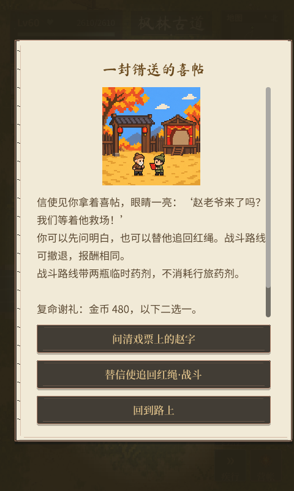

# 人间奇遇第一批交付

日期：2026-10-06。范围：玩法缺口方案新增包 P。三条奇遇已接入实际主世界；后续仓库、三环悬赏、职业机制天赋与新的成长节点仍按修订排期制作。

同日经济复核已将三条金币从120/180/240提高到480/800/1200；已领取记录保留，不重新发奖。最新经济口径见[货币来源与数值复核](2026-10-06-currency-balance-review.md)。

## 怎么找到

| 奇遇 | 解锁与入口 | 可选处理 | 复命谢礼 |
|---|---|---|---|
| 一封错送的喜帖 | s12 完成后，昭元边城的红帖；目标在枫林古道 | 问清戏票，或追回被野狼叼走的红绳 | 金币480，伙伴粮3／攻击宝石Ⅰ1二选一 |
| 会挑主人的宝箱 | s20 完成后，沉渊港的宝箱；目标在潮痕滩 | 用陆七提供的鱼干引出潮鸥，或赶走盐甲蟹 | 金币800，伙伴粮5／精炼石2二选一 |
| 雪关夜炊 | s28 完成后，霜关驿的夜炊灯；目标在霜林栈道 | 帮岑雪端汤，或先赶走兽影 | 金币1200，资质果1／精炼石3二选一 |

走近带「奇遇」名称的物件接取。接取后 HUD、小地图和目标罗盘显示当前地点；到野外核对线索后再选择处理方式，最后回原城复命。资质果可能洗低，奖励按钮及说明均提示。试喂鱼干由事件提供，不要求先钓鱼或抽到特定伙伴。

每条都只发一次谢礼，两个分支报酬相同、对白不同。三条分别留下戏帖、喂鸟箱和夜炊灯；行旅图志「人物手记」保留完成后的分支、结尾和已选谢礼。

## 存档与战斗

- 新存档版本 v7：v6→v7 只补空奇遇容器，不改原钱包、物品、装备与主线。原36条支线保持原 ID 和数量；奇遇单独记录。
- 选择、领取和去重账本一起提交；保存失败完整回滚，不显示已领取。非法地点、跳过调查、错误遭遇票据和重复领奖均拒绝。
- 战斗路线为独立遭遇：使用当前职业、装备、授业分支和伙伴，满生命入场，两瓶临时药剂；行旅生命、药剂保持原值，胜利不额外刷金币、经验、材料或主线击败计数。
- 开战前保存完整配置与固定种子。中断后仍可从当前遭遇继续相同开场；撤退、战败后保留所选分支，可以整备重试，种子保持一致。成功后才开放复命领奖。
- 新事件面板沿用现有纸面、字体和按钮；故事区独立滚动，处理方式、谢礼与返回按钮固定在底部。触控返回与键盘 ESC 均可关闭，GM 覆盖时 ESC 不穿透。

## 插图与生图要求

三张插图均由内置 image_gen 生成并复制入工程，不依赖外部生成目录。喜帖图简化重画了一版，移除多余舞台人物和细密装饰；宝箱图一名商人，夜炊图两名角色。人物用小轮廓、点状五官、简单服装，游戏内以160像素图窗和最近邻采样显示。

- [喜帖插图](../image/special_events/invitation_v1.png)
- [宝箱插图](../image/special_events/chest_v1.png)
- [夜炊插图](../image/special_events/supper_v1.png)
- [完整生图／改图提示词与保存位置](../image/special_events/prompts.json)

后续新图继续采用简洁像素角色；不把这些插图当作精确切帧的人物行走素材。

## 检查证据

- 开工基线：72项原有检查通过，日志 `tools/_logs/special_events_baseline/`。
- 新增 `VerifySpecialEvents`：六条分支、公布道具真实入袋、失败保存回滚、非法推进和重复领奖、两条地图按钮路线、实际战斗模拟、九处目标交互范围的可站立点、触控及 ESC 返回。
- 新增 `VerifySpecialEventsRead`：另一个进程读取战前配置，继续同一遭遇，复命后另一份谢礼不可领取。
- **74项检查均已获得通过结果**：完整执行日志 `tools/_logs/special_events_full/` 中70项首轮通过；四项受同工作区 HUD 更新影响的旧断言（城务文字、生命文字、样式工厂分类）已按实际语义调整。`tools/_logs/special_events_final_recheck/` 六项全部通过，包含这四项和奇遇的两个新检查；最终源代码未遗留失败用例。
- 480×800、480×1067 各15张实际场景截图，覆盖三条奇遇的选择、领奖、滚动与完成陈设，位于 `shots/special_events_20261006/`。已经逐项查看选择与领奖画面；截图证明布局，按钮和结算另外由输入检查覆盖。
- 原有引擎退出时资源诊断仍由 issue #43 单独跟踪，本轮没有声称修复该问题。

## 当前实现落点

数据 `data/special_events.json`；服务 `src/world/SpecialEventService.gd`；面板 `src/ui/SpecialEventPanel.gd`；主世界入口、导航、战斗回调在 `MapScene`；保存版本在 `SaveData`，读回白名单在 `G`；图志在 `FieldJournalPanel`。

