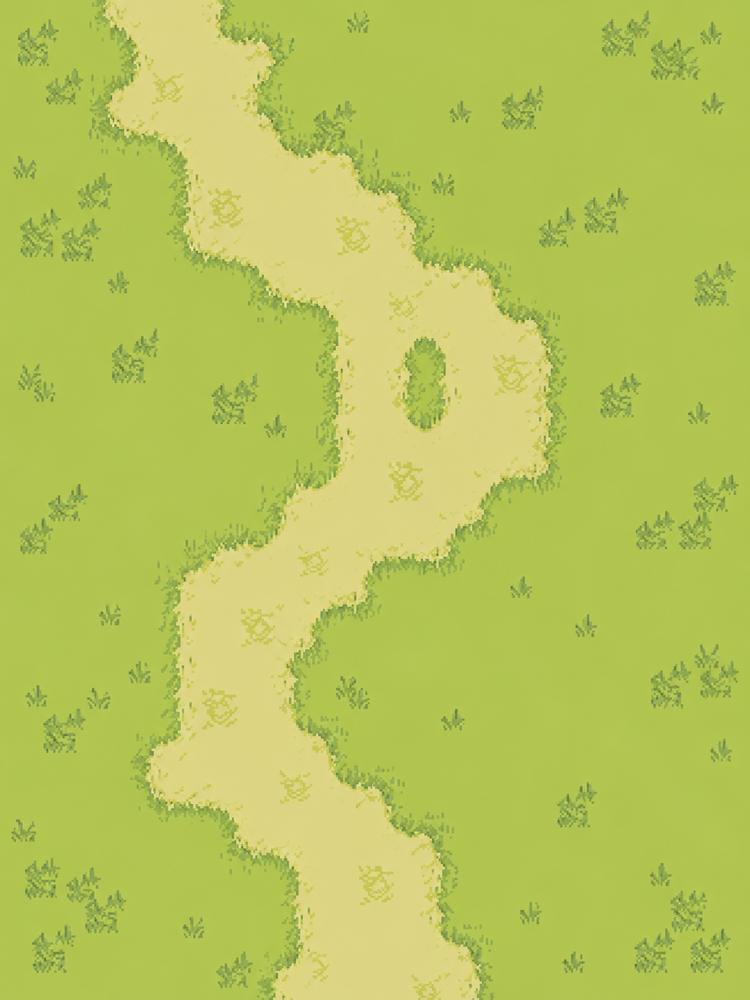
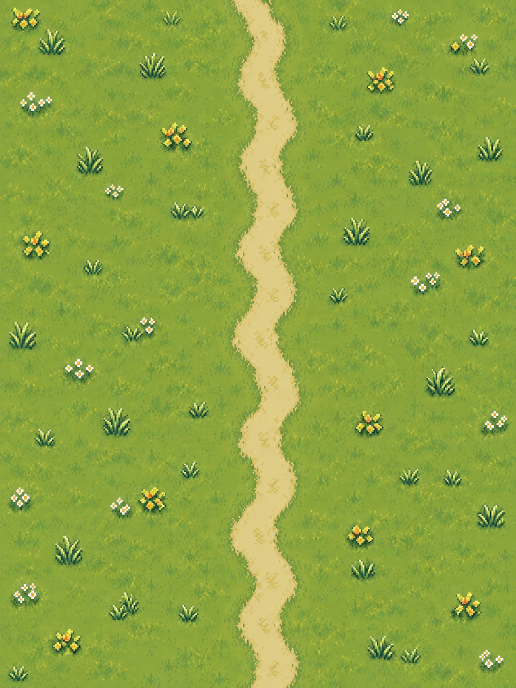

# 兼容式融合方案 v3：保留《远征》结构，加入原版主地图与原地实时战斗

> **本次修订目的：** 纠正上一版“探索图 → 另切固定战斗场”的结构性偏差。新增内容必须嵌入现有工程，不能以复刻原版为由推倒《远征》已经可玩的路线、探索、养成和存档结构。
>
> **方案关系：** 本文不再“整体取代” `2026-09-21-xajh-refit.md`，而是在其“保留工程骨架、只对齐原版表现与交互”的原则上收紧实施边界。上一版提出的独立 `CombatField.tscn`、固定对角站桩和 ATB 推断全部取消。
>
> **最终定位：** 新加入的地图承担**主世界地图**；现有八主题 `MapScene` 承担**江湖历练的探索地图**。两类地图共用当前 `MapScene`、`BattleScene`、`BattleSim`、存档与数据表，以模式参数区分，不复制第二套游戏。

## 一、目标与不可破坏项

### 1.1 一句话目标

保持《远征》现有玩法完整可玩的前提下，增加一条更接近原版《笑傲江湖》的主世界体验：在黄绿草地、浅卡其土路的地图中自由行走，接触明雷后不切换地图，在原位置附近进入实时战斗，使用“攻 / 技 / 物 / 逃”、快捷栏、自动战斗、脚下红蓝条、伤害飘字和星芒命中特效。

### 1.2 六条硬约束

| 不可破坏项 | 处理原则 |
|---|---|
| 登录、创角、首页、主城流程 | 原场景与返回路径不改，只在首页/主城增加“江湖”入口 |
| `RouteScene → MapScene → BattleScene → MapScene → RouteScene` | 完整保留，作为“江湖历练”探索玩法 |
| 八主题探索地图 | 不删除、不覆盖、不强制换图，重新定位为历练/副本探索图 |
| `BattleSim.gd`、技能、词条、Buff、怪物 AI | 不重写内核；优先改表现、输入映射和数据参数 |
| `battle_finished(result, hp_left)`、`map_finished(result)` | 信号名与参数保持兼容，现有调用方不需要重写 |
| 四币键名、存档字段、旧档 | 只做加法迁移；允许改显示名、产消和入口，但不能删旧字段导致坏档 |

新增功能必须带开关：`main_world_enabled` 和 `classic_combat_presentation`。任一新模块出问题时，可关闭开关回到当前版本，而不是回滚整个工程。

## 二、参考图：最高优先级的视觉与交互基准

### 2.1 主场景基准：`08_ui_hotbar.png`


需要复刻的是游戏画面本身：

- 近乎俯视的单层地图，无天空、地平线和大透视景深。
- 大面积黄绿橄榄草地，低对比度浅卡其土路，草簇沿路缘自然咬合。
- 人物和怪物直接站在地图上，脚下有小型椭圆投影与贴身血条。
- 顶部中央出现橙红描边“遭遇战”；右下角为红色“自动”战斗开关。
- 我方在画面左下附近、敌方在右侧附近只是该帧的即时位置，**不是固定阵位**。

不要复刻以下模拟器叠加层：左下数字键盘、左右软键、安卓导航键、顶部模拟器栏、右侧模拟器工具栏。这些不属于游戏 UI。

### 2.2 指令与信息基准：`06_map_grass2.png`


- 选中角色/进入手动指令态后，以角色附近展开“攻 / 技 / 物 / 逃”。
- “技”进入现有技能列表或二级轮盘；“物”使用药剂；“逃”沿用当前二次确认撤退。
- 名字与等级使用绿色像素字，脚下显示 HP 红条与 MP 蓝条，状态图标紧邻条体。
- 沙漏只按“行动等待/施法读条提示”实现；现有证据不足以证明原版采用 ATB，**不得为了沙漏把 `BattleSim` 改造成回合或 ATB 内核**。
- 底部技能/物品快捷栏属于游戏，可以吸收进现有五技能格；数字键盘与软键提示属于模拟器，不进入正式 UI。

### 2.3 命中效果基准：`07_combat_hit.png`


- 命中点出现白黄亮心、黄橙放射、红褐尖角的像素星芒，持续短、轮廓硬，不使用柔光粒子糊满画面。
- 重击飘字为大号红橙 `-42`，下方叠较小的“重击”，均有深色描边。
- 武器/弹道从攻击者飞向目标，命中时配合闪白、短顿帧、轻微后仰；表现结束后立刻回到地图常态。
- 玩家脚下继续保留红/蓝双条，战斗特效不能遮住条体、名字和状态图标。

## 三、地图结构：新图做主地图，旧图做探索地图

### 3.1 调整后的总流程

```text
Title / Login / CreateRole
            │
            ▼
GameHome / CityScene（现有首页与主城，保留）
      ├──────────────────────────────┐
      │ 江湖                         │ 历练
      ▼                              ▼
主世界地图（新增内容，主玩法）        RouteScene（现有肉鸽路线）
MapScene mode=main_world             │
      │ NPC / 任务 / 明雷 / 出口      ▼
      │ 原地实时战斗                  现有八主题 MapScene
      │ BattleScene 兼容表现层        mode=expedition
      ▼                              │
下一张主地图 / 返回主城               ▼
                                 现有战斗、奖励、词条三选一
                                 全部按原逻辑返回 RouteScene
```

这里的“主地图”是常驻江湖世界，不是单独的“战斗背景”；战斗发生在主地图内部。现有八主题地图仍是完整可玩的探索地图，也继续拥有拾取、祭坛、矿脉、清剿评价、小地图、罗盘、疾行与传送阵。

### 3.2 新加入地图的角色

当前已加入的四张成品先按下表使用，不覆盖 `image/map` 与 `image/map_proc`：

| 新地图素材 | 新定位 | 处理方式 |
|---|---|---|
| `g_main_city_v2_768x1024.png` | 主世界枢纽/城镇 | 保留城镇构图，作为主世界城镇底图或构图参考；功能 NPC 仍走数据表 |
| `g_lorin_wilds_v2_768x1024.png` | 第一张草地主地图 | 原图保留作构图参考；实机已改用 `image/main_world/lorin_wilds_grass_v1.png`，按 08/06 的黄绿草地与浅卡其路重做为俯视底图 |
| `g_mountain_pass_v2_768x1024.png` | 第二张山道主地图 | 桥、关隘、出口用于地图连通；碰撞与行走层独立配置 |
| `g_black_wind_camp_v2_768x1024.png` | 第三张营寨主地图 | 用于主线据点、精英明雷与首领区域，不替代历练 Boss 图 |

素材目录：`assets_regen/batch5_scene_map/ready/backgrounds/`。接入时复制到新的 `image/main_world/`，保持来源目录只读，避免再次污染已有 `image/map*`。

静态整图不能直接等同于可玩地图。每张主地图需配套一份数据配置：出生点、可行走区域、碰撞多边形、NPC 点、明雷出生区、出口和相邻地图。若整图透视与角色行走冲突，应以原版截图的俯视比例为准重绘，而不是迁就已生成图片。

### 3.3 草地主地图的强制规格

第一张主地图是整个改造的视觉样板，优先级高于其他新图：

| 项 | 规格 |
|---|---|
| 地图与镜头 | 地图保持 20×26 格；地表素材约 1086×1448，铺到 960×1248 世界坐标，主地图镜头 1.15，屏幕上约为素材原始像素密度，避免整图放大后的粗颗粒；历练镜头不改 |
| 视角 | 近俯视平面地图，不出现天空、远山地平线或写实透视 |
| 主草色 | `#b4ca4d` 为主，辅以 `#b1c161`、`#ccd270` |
| 土路 | `#dbd787`，与草地低对比过渡；宽窄自然变化，不能像规则方格铺路 |
| 暗部 | `#4a4e38`、`#61603b`，只用于草簇、路缘和像素描边 |
| 道路宽度 | 可见画面约 20%～30% 宽，保留弯曲变化；不能把整屏中部变成宽黄河道 |
| 植被 | 地表只画细密矮草、小花和低矮草簇。树、灌木、石块、建筑以及 NPC 后续作为独立实体分层摆放，并给需要的物件配碰撞；不让大树遮满战斗可视区 |
| 纹理 | 底图像素密度与游戏镜头匹配，最近邻采样；不能通过放大低密度整图来制造“像素风”，也不使用油画式笔触和柔化渐变 |
| 战斗净空 | 每个明雷区至少保留一块可容纳 2～6 个单位、飘字和指令轮的开阔草地 |

`08_ui_hotbar.png` 是草地验收主参考，`g_lorin_wilds_v2_768x1024.png` 只提供路线构图，不得反过来改变原版式俯视观感。

洛林草地底图第一版已接入实机，单独底图预览如下：



实机反馈指出第一版在近镜头下草簇和路缘被放粗。第二版以新增参考图 1 的黄绿草地、窄浅土路为主要视觉准绳，以参考图 2 的细小花草层次为辅，重绘为纯地表图；人物、怪物、树木、建筑和 UI 均不烘焙进底图。角色比例与镜头分别设为 0.92、1.15，保持人物占屏但接近底图原生像素密度：



下一轮场景丰富度分三步验收：先给独立树/灌木/石块配置可遮挡层与碰撞，再放置 NPC 和任务物件，最后按参考图 1 检查角色、怪物和场景物的相对比例；每一步用 480×800 实机截图检查，不再靠放大底图补细节。

### 3.4 复用 `MapScene`，不再新造第二套地图框架

给 `MapScene.pending_cfg` 增加兼容字段 `mode`：

```gdscript
{
  "mode": "main_world",      # 或 "expedition"；缺省按 expedition 处理
  "map_id": "lorin_wilds",
  "node": {},
  "run": null
}
```

- `mode=expedition`：完全执行当前逻辑，保证旧入口、测试和旧档行为不变。
- `mode=main_world`：读取主地图数据，启用 NPC、任务、地图出口、常驻掉落和世界进度；关闭仅属于肉鸽节点的探索评价结算、词条奖励和 `RunState` 强依赖。
- 公共能力继续复用：角色移动、Y-sort、碰撞、小地图、明雷游荡/追击、触碰开战、虚拟摇杆、疾行和覆盖层管理。

不得新增与 `MapScene` 职责重叠的 `WorldMapScene`，也不得让同一套移动/怪物/碰撞逻辑维护两份。

## 四、战斗形式：同图原地接战，保留内核只换表现与输入

### 4.1 取消独立 `CombatField.tscn`

上一版的独立固定战斗场会产生三个问题：切断原版“地图即战场”的观感、复制当前 `BattleScene` 的职责、让探索返回和存档接线变复杂。因此本版明确：

- 继续由 `MapScene` 在 `_battle_layer` 中实例化现有 `BattleScene.tscn`。
- `BattleScene` 新增 `presentation_mode="classic_inline"`，而不是新建另一套战斗场景。
- 经典模式下背景透明，保留当前地图快照/地图节点；只加战斗遮罩、单位表现、HUD 和特效。
- 战斗结束仍发出原信号并回到原地图坐标，不重新加载地图，不丢怪物/拾取/祭坛进度。

### 4.2 接战状态机

```text
自由探索
  → 明雷接触
  → 顶部“遭遇战”短横幅，停止自动前往
  → 以接触点建立临时战斗区域，冻结无关 NPC/怪物
  → 保留接战地点地图，经典战斗按敌左我右展开
  → BattleSim 开始实时 tick
  → 攻/技/物/逃、快捷栏、自动战斗均可用
  → 胜利：原地移除明雷、发奖励、恢复探索
     逃跑：保留战损并进入接触冷静期
     战败：沿当前 MapScene/RouteScene 规则结算
```

按最新需求，`classic_inline` 使用敌左、我右的横向对阵；前后排只控制双方的横向纵深，不改变 `BattleSim` 的选目标和伤害规则。探索中的接触点仍用于确定背景与战后恢复坐标。历练默认战斗维持原有上下阵型。

### 4.3 实时战斗与移动的兼容方案

现有 `BattleSim` 负责技能 CD、能量、目标、伤害、Buff、AI 和结果，继续作为唯一规则源。为了贴近原版又避免一次性重写，分两步：

1. **第一阶段必须完成：** 规则位置不改；表现角色会向目标突进、挥砍、后退，远程武器/弹道飞行，玩家看到的是同图实时交战。地图摇杆在战斗中用于轻微走位表现，不影响命中判定。
2. **第二阶段可选验证：** 在特性开关下增加战斗区域内的真实走位与攻击距离门槛；只有回归测试证明技能、AI、召唤和 Boss 均稳定后才设为默认。

第一阶段已经能获得原版主要观感，不能为追求“完全自由走位”破坏当前可用的战斗数值和 AI。

### 4.4 指令、快捷栏与自动战斗

| 输入 | 对标原版 | 与现有系统的接法 |
|---|---|---|
| 攻 | 普通攻击/当前目标 | 调用现有普攻，不另建一套伤害公式 |
| 技 | 技能二级菜单 | 复用现有五技能格、CD、能量和连携提示 |
| 物 | 药剂/战斗物品 | 复用药剂数量、冷却和战斗外补给规则 |
| 逃 | 脱离战斗 | 复用现有二次确认、战损保留和接触冷静期 |
| 自动 | 自动选技/攻击 | 复用当前自动逻辑，红色按钮仅改变表现和开关位置 |

- 指令轮默认靠近玩家展开，但必须自动避开屏幕边缘、飘字与底部安全区。
- 玩家不展开指令轮时，快捷栏仍可直接施放技能，保留《远征》当前操作效率。
- 指令轮是新增输入入口，不得删除现有键盘、快捷栏、触控按钮和自动战斗入口。
- 沙漏只显示技能前摇、公共行动等待或 AI 思考时间；它不改变实时 tick 规则。

### 4.5 战斗信息层

| 元素 | 目标规格 |
|---|---|
| 顶部横幅 | 入战“遭遇战”，结束“胜利 / 战败”；橙红像素字、深色描边，短暂出现后淡出 |
| 单位名 | 玩家/NPC 绿色；怪物可用紫色等级标签；显示“名字 + 等级” |
| 玩家条 | 脚下 HP 红条 + MP 蓝条，宽度约角色身体宽的 1.0～1.3 倍 |
| 敌人条 | 普通敌至少显示 HP 红条；有 MP 才显示蓝条；Boss 顶部大血条作为现有增强保留 |
| 状态 | 小图标贴在条体右侧，超过 3 个折叠，不在头顶堆文字 |
| 普通伤害 | 黄橙数字、深描边、短上浮 |
| 重击/暴击 | 更大的红橙负数，下方叠技能名或“重击”，遵循 07 图层级 |
| 治疗/增益 | 绿色数字/短词，不与伤害共用红色 |

### 4.6 动作与命中特效

- 近战：短距离突进 → 武器挥砍/双弯刀青蓝弧光 → 命中星芒 → 轻微后仰 → 回位。
- 远程：武器或弹道沿直线/轻弧飞行；命中前不提前扣视觉血条，事件到达时同步刷新。
- 普通命中：小星芒、闪白 1 帧、轻震；重击：大星芒、2 tick 顿帧、略强震屏。
- 震屏只作用地图与战斗单位，HUD、指令轮和飘字保持稳定。
- 死亡：优先使用原版倒地帧；没有对应素材时沿用当前死亡动画，不能因缺帧阻塞整条战斗流程。
- 特效像素边缘必须清晰，禁用大面积半透明雾、镜头泛光和现代粒子拖尾。

## 五、玩法结构：主世界贴原版，历练保留《远征》特色

### 5.1 主世界主循环

```text
城镇接任务 / 整理装备
  → 进入草地、山道、营寨等主地图
  → 寻找 NPC、出口、采集点和明雷怪物
  → 同图实时战斗
  → 获得铜钱、经验、材料、装备或技能书
  → 完成任务、解锁下一地图与剧情
  → 回城强化角色、宠物、坐骑和技能
```

这条循环负责“像原版”的部分：连续世界、地图明雷、同图战斗、NPC/任务、地图出口、角色成长。主地图不套肉鸽层数，也不每次战后弹词条三选一。

### 5.2 江湖历练探索循环

现有内容全部保留：

- `RouteScene` 每层三选一路线与 Boss 层。
- 八主题探索地图、清剿评价、拾取、祭坛、矿脉、商店、篝火、小地图、罗盘、疾行和传送阵。
- 局内金币、远征币、词条三选一、苦行难度、节点进度恢复。
- 战后返回路线、远征结算、图鉴、寻访、养成和演武场。

历练战斗可以复用新的 `classic_inline` 表现，但必须保留 `classic_combat_presentation=false` 的原表现回退开关。先让主世界稳定，再逐步给探索图启用，不能一次全局替换。

### 5.3 原版系统与现有特色的边界

| 系统 | 决策 |
|---|---|
| 地图明雷、NPC、出口切图、原地实时战斗 | 主世界优先贴近原版 |
| 坐骑、宠物、技能书、装备 | 保留当前数据骨架，视觉和命名向原版靠拢 |
| 肉鸽路线、词条、探索评价 | 保留为《远征》特色，只在历练模式出现 |
| 图鉴、寻访、演武场、委托 | 保留；入口和产出与主世界任务串联 |
| 原版付费商城/旧网游收费方式 | 不复刻；改为本地玩法产出与可解释的货币消耗 |

## 六、货币与经济：允许调整，但不破坏旧档

底层继续保留 `gold / expedition / soul / honor` 四个键，显示和用途调整如下：

| 存档键 | 新显示名 | 主要来源 | 主要消耗 | 出现范围 |
|---|---|---|---|---|
| `gold` | 铜钱 | 主世界怪物、任务、探索拾取 | 药品、装备强化、商店、传送 | 全局主币，常驻显示 |
| `expedition` | 历练令 | 历练节点、清剿评价、远征结算 | 历练商店、局外词条/路线相关成长 | 仅历练及相关商店重点显示 |
| `soul` | 灵玉 | 稀有任务、Boss、成就、活动 | 江湖寻访、宠物/伙伴契约 | 稀有币，控制产量 |
| `honor` | 声望 | 演武场、精英委托、阵营任务 | 称号、外观、荣誉商店 | PVP/声望页面重点显示 |

调整规则：

- 不删除或重命名存档键；旧档读取后数值原样保留。
- 首页不必把四币同权并排，可常驻“铜钱 + 灵玉”，其余在对应玩法页显示，减轻 UI 负担。
- 主世界普通怪不直接大量产出灵玉和声望，避免所有玩法被刷怪替代。
- 历练令继续服务肉鸽玩法，不能改成主世界的第二种铜钱。
- 新经济参数全部放数据表，禁止散落在 UI 脚本中硬编码。

## 七、文件级实施方案

### 7.1 数据与场景落点

| 改动 | 文件 | 方式 |
|---|---|---|
| 主地图定义 | 新增 `data/main_world_maps.json` | 配置地图相邻关系、出生点、碰撞、NPC、怪物区、出口、音乐与昼夜色调 |
| 地图模式 | `src/explore/MapScene.gd` | 增加 `mode` 分支；缺省保持 `expedition`，公共移动/碰撞/明雷逻辑不复制 |
| 主地图入口 | `src/ui/GameHome.gd`、`src/city/CityScene.gd` | 新增“江湖”入口；现有“主城/出征”入口保留 |
| 战斗表现模式 | `src/battle/BattleScene.gd` | 增加透明背景、地图快照/挂载点、指令轮、原版式信息层与特效 |
| 战斗规则 | `src/combat/BattleSim.gd` | 原则上不改；只有真实走位实验需要的最小接口可在第二阶段加入 |
| 主地图进度 | `src/save/SaveData.gd`、`G.gd` | 新增带默认值的 `main_world` 字段；旧档自动补空字典 |
| 新图成品 | 新增 `image/main_world/` | 从 batch5 的 ready 目录选择性接入并重修；不覆盖现有地图素材 |
| 经济参数 | `data/drops.json`、`data/shop.json`、`data/exchange.json` 等 | 保留键名，调整来源、消耗、显示名与数值 |

### 7.2 实施顺序

| 阶段 | 内容 | 验收后才能进入下一阶段 |
|---|---|---|
| S0 安全网 | 为现有首页→历练→探索→战斗→结算保存基准截图和回归结果；加两项功能开关 | 关闭开关时行为与当前版本一致 |
| S1 草地主地图 | 按 08 图重修草地，配置可行走区、NPC、明雷、出口；`MapScene mode=main_world` 跑通 | 可从首页进入、行走、退出、保存并恢复坐标 |
| S2 原地接战 | 保留地图画面，挂载 `BattleScene classic_inline`，结束后原地恢复 | 不重新加载地图，怪物/拾取/任务进度不丢 |
| S3 原版信息层 | 遭遇战横幅、脚下红蓝条、名字等级、状态图标、经典飘字 | 与 06/08 并排比对通过 |
| S4 指令与特效 | 攻技物逃、快捷栏共存、自动按钮、投掷/弧光、星芒、顿帧、死亡 | 与 06/07 并排比对，所有现有技能仍可用 |
| S5 主循环 | NPC 任务、出口切图、主世界掉落与成长接线 | 城镇→草地→山道/营寨→回城完整跑通 |
| S6 经济调整 | 四币显示层级和产消调整，旧档迁移 | v1/v2/v3/未来档测试不回退、不清零 |
| S7 探索复用 | 在单张历练图试开经典表现，再逐主题放量 | 八主题原玩法、词条、评价、结算全绿 |

### 7.3 当前实机进度（2026-09-23）

- 首页右侧新增独立“江湖”入口，底部原热区仍进入主城；历练入口继续保留。
- 已跑通洛林郊野第一张主地图：角色移动、明雷、原地接战、即时奖励入账与回城均复用现有 `MapScene` / `BattleScene`。
- 草地底图已换成独立俯视像素图；原生成整图留在来源目录，不覆盖历练地图素材。
- 按最新画面反馈提高了主地图角色占屏比例并收紧镜头，调整出生点让角色落在舒适跟随区；历练地图仍保持原人物比例与镜头范围。
- 主地图离开/回城/撤退会保存坐标；胜利时同步保存明雷永久编号和战利，重进从原地续玩且已击败怪物不复活。新增回归覆盖奖励不重复与历练镜头不变。
- S4 已接入“攻/技/物/逃”四向指令轮：按角色站位在邻近空隙自动选位并避开战斗单位；展开时收起触发键，技能列表则继续使用底部安全区，原快捷栏与自动战斗保留。专项回归覆盖了指令轮占位、技能页切换、集火、药剂和撤退。
- S4 特效首轮已落地：仅经典同图表现下的远程普攻会先发射短弹道，抵达后才闪白、飘字并更新显示血条；BattleSim 仍在原 tick 结算，普通历练战斗不变。命中星芒改为分层硬边色块，顿帧和震屏仍复用旧效果。`VerifyBattleScene` 弹道专项输出 `BATTLE_SCENE_OK`；完整回归尝试受限于当前运行环境不能写入 `user://save_verify_*` 与 `user://logs`，需在可写用户数据目录重跑。
- 当前仍是一张地图的可玩纵切片。下一步完成 S4 的 06/07 并排实机验收，再接 S5（NPC 委托、第二张主地图连通、城镇→草地→山道→回城），之后做 S6 经济旧档兼容和 S7 历练复用。
- 根据最新实机反馈，洛林郊野由 32×42 缩为 20×26 格，出生点与出口随之重设，镜头推进至 1.55；新行走帧在实机中偏大，角色本地比例回调到 0.68，仍因镜头更近而比历练占屏稍大。旧版坐标按比例迁移并记录 `layout_version`，历练地图数值不变。
- 经典同图战斗固定为“敌左、我右”的横向对阵，前后排体现为横向深度，列号展开为竖向站位。`classic_inline` 的单位视图、打击方向和指令轮统一使用新坐标；普通历练战斗继续使用原上下阵型。
- 下一步先用 06/07 截图验收横向对阵的单位间距、轮盘避让和命中特效，再推进 S5 的 NPC 委托及第二张主地图；不以扩大地图面积来凑流程时长。
- 新参考图反馈后，主地图换成 `lorin_wilds_grass_v2.png`：窄浅土路与细密黄绿草地由纯地表图提供，镜头从 1.55 回调到 1.15、人物本地比例设 0.92，实机占屏大小基本不变但底图不再被明显放大。出生点移至 [480, 980]，使角色处于更舒适的屏幕位置。第一版底图保留作为历史版本。

## 八、验收清单

### 8.1 结构保护

- [ ] 关闭两个新开关后，当前游戏流程、画面与存档行为保持不变。
- [ ] `RouteScene`、八主题 `MapScene`、词条、清剿评价和结算没有被主世界逻辑侵入。
- [ ] 没有新增与 `MapScene`/`BattleScene` 重复职责的第二套场景框架。
- [ ] 旧存档四币、角色、宠物、装备、世界进度均能读取；新字段有安全默认值。
- [ ] 战败、撤退、强退重进和战斗中异常退出不会复制奖励或复活已击杀怪物。

### 8.2 主地图与原版相似度

- [ ] 草地是 `#b4ca4d` 附近的黄绿橄榄，不是深绿森林或高分辨率写实草坪。
- [ ] 土路是浅卡其、低对比、蜿蜒且边缘由草簇过渡，与 08 图观感接近。
- [ ] 地图为近俯视平面，没有天空和地平线；角色像素比例接近原版。
- [ ] 遇敌后地图不切走，顶部出现“遭遇战”，胜负后回到原坐标继续探索。
- [ ] 明雷怪物在地图游荡/追击，NPC 名绿、怪物等级标签清晰。

### 8.3 战斗相似度

- [ ] 普通态可见脚下红/蓝条、状态图标、快捷栏与红色自动按钮。
- [ ] 手动态能展开攻/技/物/逃，且不遮挡角色、屏幕边缘和底部安全区。
- [ ] 07 图式星芒在命中点爆开，重击数字和技能名的层级、颜色、描边接近参考。
- [ ] 近战突进/回位、远程投掷、闪白、顿帧、轻震和死亡动画都由现有战斗事件驱动，不出现伤害与画面不同步。
- [ ] 技能 CD、能量、连携、词条、Buff、召唤、Boss、自动战斗和撤退结果与改造前一致。

### 8.4 不应出现的内容

- [ ] 不把模拟器数字键盘、软键、安卓导航和右侧工具栏画进游戏。
- [ ] 不把沙漏误解成必须重写的 ATB/回合制系统。
- [ ] 不把横向对阵推广到默认历练战斗，也不为站位表现改写技能距离和 AI 规则。
- [ ] 不用独立 `CombatField.tscn` 替换现有 `BattleScene`。
- [ ] 不因接入新主地图删除、覆盖或降级现有探索地图。

## 九、风险与止损

1. **新地图整图透视不适合行走：** 先以草地图为样板重修俯视版本；原 ready 图保留为构图参考或地图选择封面，不硬塞进实机地图。
2. **同图战斗与当前静态阵位有差异：** 第一阶段只做表现位移，规则仍由 `BattleSim` 决定；真实距离判定放到独立开关下验证。
3. **主世界与历练逻辑串味：** 所有分支以 `mode` 明确区分，缺省值永远走旧的 `expedition`；测试必须覆盖两个模式连续往返。
4. **UI 信息过密：** 原版核心元素优先，现有 Boss 大血条和技能格保留；非战斗信息在接战时折叠，不能同时堆满屏幕。
5. **经济改动伤旧档：** 只调整显示名、来源和消耗，不删除键；上线前用所有存档 fixture 回归并检查数值守恒。
6. **素材版权：** 原版截图和提取素材仅用于个人学习与视觉比对；如需公开发布，主地图、UI、角色和特效必须使用自制或权利清晰的重绘资产。

## 十、最终决策摘要

- 现有八主题地图 = **江湖历练探索地图**，完整保留。
- 新加入的城镇/草地/山道/营寨 = **主世界地图**，其中草地必须以 `08_ui_hotbar.png` 为最高参考重修。
- 战斗 = **地图内原地实时战斗**，不切独立战斗场；复用 `BattleScene + BattleSim`。
- 操作 = 现有快捷栏与自动战斗保留，再增加原版式“攻 / 技 / 物 / 逃”。
- 视觉 = 对标 `06_map_grass2.png`、`07_combat_hit.png`、`08_ui_hotbar.png`，但剔除模拟器叠加 UI。
- 玩法 = 主世界贴原版，肉鸽探索、词条、图鉴、寻访、演武等《远征》特色继续存在。
- 货币 = 允许改名和重做产消，但四个存档键不删，保证旧档兼容。
