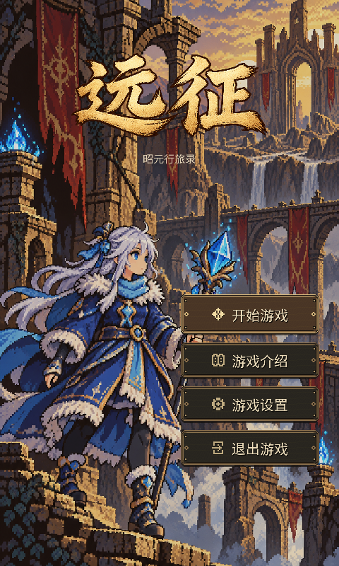

# 入口与全界面精修 · 2026-10-02

加载与标题恢复原有古城插画。四个标题入口改用深木色、旧金属包边、铆钉和像素符号，与背景中的石墙、旗帜和金属饰件协调。正文、标题、页签和帮助阅读重新分层，保留现有场景、存档、任务和操作流程。

## 实机效果

- [标题入场动画](../../shots/aesthetic_refinement_20261002/title_intro_motion.gif)：实际 Godot Tween 的 26 帧录制，包含艺术字渐显和按钮淡入。
- [95 个场景状态的前后对照](../../shots/aesthetic_refinement_20261002/final/index.html)：点击图片查看原尺寸，可搜索和筛选长屏。
- [截图与复现说明](../../shots/aesthetic_refinement_20261002/final/README.md)。



## 本轮调整

| 范围 | 具体结果 |
| --- | --- |
| 加载与标题 | 使用原有 `image/background/enter.png`，收起长说明，加载进度改成细线；长屏下内容居中。 |
| 标题艺术字 | 新增透明「远征」字标，按笔画区域渐显并轻微落位；副标题和菜单分时淡入。 |
| 四个入口按钮 | 全部替换成代码绘制的木纹底、斜角旧金边、内凹高光、四角铆钉及 9×9 像素图标；主入口稍高，选中时提亮，按下时下沉 1 像素。保留鼠标和方向键/确认键操作。 |
| 字体 | 页面大标题采用 Noto Serif CJK 简体半粗；小字和按钮采用现有 Noto Sans SC，撤去多数描边和过大的字间距。深色纸面字、暖白暗场字保持清楚。 |
| 图标 | 接入 24 个原创 SVG 导航符号，统一线宽与尺寸；营帐、养成、设置、登录、帮助使用对应语义。标题四按钮单独采用像素符号。 |
| 设置 | 拆成「常规 / 旅人 / 存档」三个命名页面，保留音量、游戏选项、昵称头像、存档导入导出与重置确认。 |
| 游戏介绍 | 改成「世界 / 旅人 / 启程」三个插画页面；使用原场景图、四名角色头像和旅程图形，减少首屏文字。 |
| 养成与伙伴 | 养成采用六块图标入口；伙伴拆成「协战 / 训练」两页，保留训练代价、规则与可执行操作，详细内容进入帮助。 |
| 长帮助 | 按完整段落分为阅读页，提供上一页、下一页和页码；过长的单段仍可滚动。确认类对话保持原流程，不隐藏必要的决策信息。 |
| 营帐 | 恢复原有营地背景，撤去发光圆台；人物脚下增加轻接触影，八项入口改用有语义的图标。返回操作缩为「继续旅程」。 |
| 功能面板 | 统一轻纸面、细边与低饱和金色；大面板使用短淡入，帮助入口换成同族图标。背景使用低对比材质纹理。 |
| 建筑落地 | 按原建筑透明通道提取实际底座轮廓，生成贴底接触影、短投影和轻地面磨痕；雪地与草地分别染色，碰撞与排序保持原位置。 |
| 阴影性能 | 加载页逐帧预热 8 类常用建筑；缓存按资源路径和显示尺寸索引，避免首次进入城镇时集中生成。 |

## 参考与素材

参考了官方游戏界面对信息密度、分类入口与阅读层次的处理：[WoW 界面与 HUD 更新](https://news.blizzard.com/en-us/article/23837944/get-into-the-grid-of-things-with-the-updated-ui-and-hud)、[FFXIV 界面手册](https://na.finalfantasyxiv.com/game_manual/view/)；文字可读性参考 [Xbox 文本显示指南](https://learn.microsoft.com/en-us/xbox/accessibility/xbox-accessibility-guidelines/101)。具体材质与排版按当前像素插画重新制作。

- 字标由内置 ImageGen 生成，原图保持透明；运行时用 AtlasTexture 裁去透明边，并通过着色器控制显现。
- 标题按钮、木纹和像素图标均为原创 Godot 绘制，导航图标为原创 SVG。
- Noto Serif CJK 来自 [官方字库](https://github.com/notofonts/noto-cjk/tree/main/Serif/OTF/SimplifiedChinese)，随项目附带 SIL Open Font License 1.1。
- 完整生成提示词、来源、尺寸、许可和 SHA-256 见 [本轮素材记录](2026-10-02-aesthetic-assets.json)。原加载、营地及角色素材继续使用项目资源。

## 验证结果与边界

| 验证 | 结果 |
| --- | --- |
| 原生截图 | 本轮选取 95 个场景状态，95/95 成功；59 张 480×800、36 张 480×1067。覆盖标题、登录、设置、介绍、帮助、养成、装备、伙伴、城镇、主世界与战斗代表页。 |
| 视觉复查 | 通过分类总览扫查，并按原尺寸查看标题、设置、养成、伙伴、介绍、阅读帮助和建筑落地等代表画面；出图成功与审美判断分开记录。 |
| 入场动画 | 26 张实际视口帧组成 GIF；末帧与最新静态标题图像逐像素一致。 |
| 最新针对性回归 | `aesthetic_delivery_check`：`VerifyVisualRefresh`、`VerifyUiLayout`、`VerifyNav`、`VerifyPerf`，4/4 通过。分页帮助测试点击实际翻页按钮，并确认原段落完整保留。 |
| 全量回归 | `aesthetic_final_regression`：45 项中 43 项通过。设置、伙伴、导航、城镇、主世界与战斗相关检查通过。 |
| 未通过 | `VerifySave` 写盘模式检查 1 条失败；`VerifyStory` 当前 17 条失败，上一轮为 16 条，本轮额外出现「回报闻叔应发放 80 金」失败。失败类别相同，但不能记作断言数量未变，也不能将全量回归记为通过。 |
| 最新性能 | 加载预热含编译 2063 ms；营帐进入 53 ms（预算 200）；城镇进入 202 ms（预算 320）；抽查面板首次打开不超过 30 ms。未放宽原预算。 |
| 玩家存档 | 回归工具确认玩家 `user://save.json` 哈希不变；截图与动画使用独立测试档。 |
| 退出诊断 | 仍有引擎退出时 RID、资源在用与纹理释放诊断，沿既有 issue #43 单独记录。最新 4 项检查出现 9 条退出资源诊断；不把它们描述成零错误。 |
| 范围 | 本轮是 95 个代表状态复拍；上一轮 256 张图库保留为对照。长屏使用真实独立 SubViewport，尚未做手机真机触控验收。 |

剧情测试初始化仍会继承部分已加载进度，可能影响支线和奖励断言；这是待定位线索，本轮没有把该推测记为根因，也没有修改玩法逻辑或删减失败测试。

日志保存在 `tools/_logs/aesthetic_final_regression` 与 `tools/_logs/aesthetic_delivery_check`，原生截图各自附有 `.log`。重新运行当前 `project.godot`，即可从加载进入新标题页，点击四个入口查看对应页面。

## 复现

在项目目录执行，`<Godot>` 使用 Godot 4.7.2 console.exe 的绝对路径：

```powershell
python tools/capture_visual_matrix.py --godot "<Godot>" --extras --output shots/aesthetic_refinement_20261002/final --only load,title,title_settings,login,createrole,settings,settings_profile,settings2,companion_first,companion_locked,companion_second,companion_help,title_intro,title_intro_party,title_intro_journey,reading_help,reading_help2
python tools/build_visual_gallery.py --output shots/aesthetic_refinement_20261002/final --before shots/visual_refresh_20261001/final
powershell -NoProfile -ExecutionPolicy Bypass -File tools/run_regression.ps1 -Only VerifyVisualRefresh,VerifyUiLayout,VerifyNav,VerifyPerf -Expected 4 -LogDir tools/_logs/aesthetic_delivery_check
```

上述截图命令用于复拍入口与分页代表状态；完整实拍列表以图库 `results.json` 为准。`manifest.json` 列出可选矩阵，不代表所有场景都已在本轮重拍。

---

# 追加轮 · 营帐木牌与任务窗口（2026-10-02 下午）

上一轮之后营帐主页仍留有两处"模板脸"：顶部横幅与八个功能入口是"平面色块 + 圆角 + 1px 细边"的统一矩形阵列，主线目标文字直接压在营地背景上。本轮把三处一起收掉。

## 本轮改动

| 范围 | 具体结果 |
| --- | --- |
| 横幅木匾化 | `G.banner_box` 重写为 `WoodPlaque` 自绘面板：程序化木纹底（`wood_grain`，按底色缓存，公式与标题页木钮同源）、五层厚度语言（落影→深边→木纹→旧金包边→顶高光/底压暗）、四角 L 形金饰、标签加深色字影。36 处调用点（全部面板标题与主城名牌）随之一并升级。 |
| 八宫格木质入口 | 新增 `_WoodEntry`（GameHome 内部类）：208×62 木牌 + 内凹图标槽（深底、旧金描边、顶压暗/底透光）+ 四角铆钉 + SVG 导航图标（暖金染色，缺素材回退字母）。布局从右侧竖列小圆钮改为 2×4 网格。 |
| 任务收进窗口 | 主页删除主线文字行，新增 320×44 木质宽钮「任务 · 主线与今日委托」（9×9 像素卷宗符号，今日委托可交付时亮红点）。`QuestPanel` 从"委托板"升级为"任务"窗口：主线分区卡（目标/前往/奖励，无进行中主线时显示 `story_goal_short()`）+ 今日委托分区，主页与主城共用同一入口语义。 |
| ESC 与可见性 | `_set_home_content_visible` 排除任务浮层；`_close_overlay_with_escape` 首位处理任务窗口。 |

## 验证结果与边界

| 验证 | 结果 |
| --- | --- |
| 针对性回归 | `ui_refresh_check`：VerifyUiLayout、VerifyCity、VerifyGameHome、VerifyQuests、VerifyNav，5/5 ALL GREEN。主线卡放在 `_content` 而非 `_list`，规避 VerifyUiLayout #13 的委托卡结构断言与 `_refresh()` 重建。 |
| 截图核对 | `shots/ui_wood_20261002/`：home/quests 各 480×800 与 480x1067 两档共 4 张，肉眼核对木纹、金边、铆钉、图标槽、任务钮排版与横幅在羊皮纸面板上的协调性，通过。 |
| 全量回归 | `ui_wood_final`：45 项中 43 项通过，与上轮基线完全一致（VerifySave 写盘 1 条、VerifyStory 17 条为既有失败）。 |
| 性能 | 首轮全量回归 VerifyPerf 失败（GameHome 224ms/CityScene 413ms 超预算）。排查：木纹生成实测仅 3-4ms/张；A/B 对照（临时环境变量切回平面横幅）与跳过营帐直进主城均不回落。根因是环境干扰——编辑器启动的游戏调试实例（12:29 起）与一个挂死的探针进程在后台持续占 CPU，把包括加载页预热在内的所有指标一致拖慢约 2 倍。清理后复测 VerifyPerf 通过：预热 2478ms、营帐 74ms（预算 200）、主城 268ms（预算 320）、各浮层 13-37ms。 |
| 玩家存档 | 全量回归确认玩家 `user://save.json` 哈希不变。 |
| 边界 | 任务窗口沿用委托板的羊皮纸卡；「继续旅程」保留全游戏统一的金色主操作钮语言（与木质导航牌形成主次分层，未单独换皮）。 |

## 复现（追加轮）

```powershell
python tools/capture_visual_matrix.py --godot "<Godot>" --only home,quests --output shots/ui_wood_20261002
powershell -NoProfile -ExecutionPolicy Bypass -File tools/run_regression.ps1 -Proj . -Expected 45 -LogDir tools/_logs/ui_wood_final
```

注意：VerifyPerf 对后台 CPU 负载敏感。若编辑器里正在跑游戏调试实例或残留 headless 进程，进场景耗时会整体翻倍，先清理再测。

---

# 追加轮 · 全量像素精修（2026-10-02 晚）

上一轮之后，设置页等页面仍是"平面色块 + 圆角 + 软模糊阴影"的统一模板脸。本轮把营帐木牌那套厚度语言推广到全游戏的纸面、按钮、条带与卡片：同一个视觉语言，只换材质与明暗方向。

## 语言与实现（工厂层）

| 机制 | 说明 |
| --- | --- |
| 切角八边形 | `G.octagon_path(sz, inset, cut)`：2–3px 的 45° 切角取代圆角。"机床感的圆弧"与"手作感的切角"是两种审美，全项目统一走后者。 |
| 硬边落影 | `G.draw_hard_shadow()`：偏移的深色多边形取代 StyleBoxFlat 的软模糊阴影——软影是"现代 UI 渲染感"的主要来源。 |
| `PaperPanel` | 五层自绘纸面：硬影→八边形纸底→程序化纸纹→内缘做旧→顶高光/底压暗→描边。`parchment_box` 的全部调用点（数十个面板）随之升级。 |
| `PixelButton` | 切角 + 顶高光/底压暗 + 硬影 + 描边；`set_surface(bg, edge)` 换肤；保留透明 StyleBoxFlat 承载 content_margin，避免影响 `UIIcons.button_icon` 的图标内边距；`meta.tab_selected` 触发底边 2px 旧金线。 |
| `InsetSlot` / `InsetPanel` | 内凹语义（顶压暗 / 底透光，与凸起正好相反）：图标槽、宝石孔、任务卡、写字区。 |
| `InsetBand`（本轮新增） | 非容器版内凹条带（Panel 语义，子控件仍手动布局）：信息带、余额条、免费召唤条、资源栏。`glow > 0` 时在描边外画呼吸金线，取代圆角 + 软影光晕这种"现代 UI 光晕"。 |
| `info_button` | 改为双层圆 Panel（外旧金圈 + 内做旧纸圈），不再用描边 Label 近似金环。 |

## 本轮逐页改动

| 页面 / 控件 | 改动 |
| --- | --- |
| 设置 SettingsPanel | 关闭钮改双层圆 Panel（外金圈 `b39a68` + 内木圆 `3a2c1c` + `×`）；滑杆槽改切角；滑块 grabber 改逐像素八边形（顶高光带 / 底压暗带 / 外缘压深），删除旧的径向渐变圆钮；页签走 PixelButton + 金线。 |
| 召唤 GachaPanel | 稀有度 chip、保底进度条、菱形标记、卡名底衬全部去圆角（"新"角标改直角 + 底边加重 1px）；主打带 / 余额条 / 免费条 / 奖池卡改 InsetBand；免费条的呼吸金边从"圆角 + 软影光晕"改为描边外金线，`_free_glow` 及其旧皮肤整体删除；奖池卡左沿色带改直角色块并内缩避开切角。 |
| 演武场 ArenaPanel | 段位进度条两根去圆角；对手预览卡从 corner10 大圆角 + 淡底改为 PixelButton（保持"点卡片换对手"），图标与两行字挂内层 Control。 |
| 技能书 SkillBookPanel | 技能大卡（corner10 + 软影）→ InsetPanel；对比区单元格（corner8）→ InsetSlot。 |
| 养成 PetRaisePanel | 金操作钮（corner12 + 软影）→ PixelButton，与 `gold_button` 同一套按钮语言。 |
| 称号 TitlePanel | 称号卡（corner8 + 软影）→ InsetPanel；左缘状态色条内缩避开切角。 |
| 商店 ShopPanel | 货架分组带（corner6 + 2px 粗边）→ InsetBand。 |
| 出征 DeployPanel | 三页签从"药丸圆角 15"改 PixelButton + 底部金线（与 `G.page_tabs` 统一）；删除 `_tab_sbs` 样式数组，`_refresh_tabs` 改走 `set_surface`。 |
| 头像 AvatarPanel | 预览金框与职业卡去大圆角（2px 微倒角）、去掉软影。 |
| 登录 Login | 头像卡去圆角（2px 微倒角）。 |
| 立绘卡 SlideCard | 插画底与稀有度外框从 corner12 / corner10 改 3px（≈ 切角语言同宽）。 |
| 创角 CreateRole | 立绘外框从 corner10 改 3px。 |
| 营帐 GameHome | 资源栏横带（corner9 药丸）→ InsetBand；头像金框去圆角；进度条轨道与填充去圆角。 |

## 验证

| 验证 | 结果 |
| --- | --- |
| 针对性回归 | `refine_pixel_check`：VerifyVisualRefresh、VerifyUiLayout、VerifyNav、VerifyPanels、VerifyGameHome、VerifyQuests，6/6 ALL GREEN。 |
| 全量回归 | `refine_pixels_full`：45 项中 **43 项通过**。 |
| 未通过（与基线逐字一致） | VerifySave 1 条（「重新写盘后应回到 current 模式，实为 invalid」）；VerifyStory 18 条。与上一轮 `ui_wood_final` 日志逐条比对：**新增 0 条、修复 0 条，断言文本完全相同**。注：上一轮正文记的 VerifyStory「17 条」与当期日志实际的 18 条不符，以日志为准更正。 |
| 排查记录 | 曾怀疑剧情失败来自仓库内固定 fixture `res://tools/_logs/save_verify_story.json` 跨轮累积（测试 `_ready` 只重置部分字段、不清档）。已实测排除：移走 fixture 后仍为 18 条，且连续两次复跑稳定 18。失败断言集中在 `prog.side` / `prog.ledger` 的支线状态（首领支线、足迹实体、石匣世界旗、草根采集），属既有未定位问题，与本轮视觉改动无调用路径关联——仍按"未定位"记录，不记为已修复。 |
| 性能 | 预热 2433 ms；营帐 84 ms（预算 200）；主城 242 ms（预算 320）；各浮层首次 ≤40 ms、二次 ≤27 ms，全部在预算内。测试期间后台仅有用户自己的 Godot 项目管理器（空闲），未见上轮那种游戏调试实例干扰。 |
| 玩家存档 | 回归工具确认 `user://save.json` 哈希不变。 |
| 截图 | `shots/refine_after2_20261002/`：26 个场景 × 480×800 / 480×1067 两档共 45 张，`CAPTURE_MATRIX 45/45`。 |
| 像素级核对 | 局部裁剪 + 4x NEAREST 放大 + 逐像素扫描确认切角真实生效（对手卡顶行内缩 2px；技能卡边色呈 `y+1 → x−1` 的 45° 递进）。纯看图会把 2px 切角误判成"大圆角"，1px 级细节一律以像素扫描为准，不采信全图目视判断。 |
| 边界 | 圆形语义元素保留圆形（`info_button` 圆钮、等级珠）；地图 / 城镇 / 战斗场景内的残留圆角块与进度条属场景层，本轮未纳入，留作后续。 |

## 复现（全量像素精修轮）

```powershell
python tools/capture_visual_matrix.py --godot "<Godot>" --only home,gacha,arena,skillbook,pet_raise,titles,exchange,city_shop,avatar,login,createrole,deploy,deploy_pet,deploy_role,bag,bag_full,equip,forge_enhance,forge_gem,forge_refine,growth,quests,settings,settings2,map,picker --output shots/refine_after2_20261002
powershell -NoProfile -ExecutionPolicy Bypass -File tools/run_regression.ps1 -Proj . -Only VerifyVisualRefresh,VerifyUiLayout,VerifyNav,VerifyPanels,VerifyGameHome,VerifyQuests -Expected 6 -LogDir tools/_logs/refine_pixel_check
powershell -NoProfile -ExecutionPolicy Bypass -File tools/run_regression.ps1 -Proj . -Expected 45 -LogDir tools/_logs/refine_pixels_full
```

比对失败断言集时，直接 diff 两轮 `VerifyStory.log` 的 `FAIL:` 行，比对比总数更可靠——总数会因文档笔误与断言增删而误导。

---

# 追加轮 · 场景层续做（2026-10-02 深夜）

上一轮把像素厚度语言推广到 UI 层，但**地图 / 城镇 / 路线 / 战斗等场景层**仍留有"圆角 + 平面色块 + 软模糊阴影"的老写法（当时明确列为"留作后续"）。本轮把这些残留一并收进同一套语言：切角八边形取代圆角、硬边落影取代软影、凸起走"顶高光 / 底压暗"、内凹走"顶压暗 / 底透光"。

## 工厂层新增入口

| 机制 | 说明 |
| --- | --- |
| `InsetPanel.set_surface(bg, edge)` | 原 `InsetPanel` 只有 `setup(bg, edge, ml, mr, mt, mb)`，改色必须重传四边 margin；新增 `set_surface` 只换底色与描边色并 `queue_redraw()`，**不动布局**。与 `InsetBand` / `PixelButton` 的同名入口语义一致，供交互态切换（选中 / 常态）统一调用，避免回退到直接改 `StyleBoxFlat` 颜色字段。 |

## 本轮逐文件改动

| 文件 | 改动 |
| --- | --- |
| `G.gd` | `class InsetPanel` 新增 `set_surface(bg, edge)`（插入在 `setup()` 之后、`_draw()` 之前）。 |
| `MapScene.gd` | 8 处：主世界状态带 `root`、金币 `gold_chip`、主线 `story_chip`、侧栏 `_side_chip` 由圆角 4 + 平面色 → `InsetBand` + `set_surface`；目标签 `goal_chip`、经验签 `exp_chip` 由圆角 → `InsetPanel`（原样传四边 margin，排版零变化）；药剂数量角标 `badge` 由"圆角 8 药丸" → `PixelButton` 切角小牌（取回 stylebox 把 top/bottom margin 改回 0，保住 13px 字不被压）；篝火祝福移除行 `row` → `InsetPanel`。 |
| `CityScene.gd` | 3 处：提示条 `hint_chip`、城中营生活动行 `row`、布告栏悬赏行 `brow` 全部由圆角半透明块 → `InsetPanel`。保留 L1559 halo 圆角 64（圆形语义）、L2643 圆角 0（本就是方角）。 |
| `RouteScene.gd` | 2 处：`_chip()` 由"四角刻意不一致的圆角 + `G._apply_shadow` 软影" → `InsetPanel` 切角深色小签；HP 条"素材缺失回退分支"圆角 4 / 3 → 2 / 1（切角语言同宽）。 |
| `BattleScene.gd` | 4 处：功能签 `_func_chip` / `_pixel_chip` 由圆角 3 平面色块 → `InsetPanel` 切角；**`_chip_set_active` 必须同步重写**（换类后 `StyleBoxEmpty as StyleBoxFlat` 会得 null，选中态会静默失效），改走 `InsetPanel.set_surface` 并新增 `_chip_idle_surface()` 提供常态底色；技能格圆角 `2/4` → `2`，技能呼吸光圈 `2/6` → `2`；施法信息卡由圆角 5 → `InsetPanel`（保留 `set_meta("skill_caster", ...)`）。 |
| `SlideCard.gd` | `class_name SlideCard extends PanelContainer`。`_sb` 只留版面留白（透明底），卡面（硬影 + 纸底 + 内缘做旧 + 顶高光/底压暗 + 切角描边）全部改由新增的 `_draw()` 自绘；`set_selected()` 由改 stylebox 字段改为置 `_sel_on` + `queue_redraw()`；状态徽标圆角 9"胶囊" → 2px 切角。 |
| `ExchangePanel.gd` | `_entry_row` 兑换行由"四角微差圆角 + 2px 边 + 软影" → `InsetPanel`（`G.BOX_BG` / `G.BOX_EDGE`）。 |
| `MountPanel.gd` | 坐骑卡由"四角微差圆角 + 软影" → `InsetPanel`；内层是手摆 `Control`，`setup(..., 0,0,0,0)` 不影响版式。 |

## 验证

| 验证 | 结果 |
| --- | --- |
| 无头解析检查 | `--headless --quit` + grep `SCRIPT ERROR\|Parse Error\|ERROR:` 无输出，通过。 |
| 针对性回归 | `scene_pixels`：VerifyMapScene、VerifyMainWorld、VerifyWorldSession、VerifyCity、VerifyRouteScene、VerifyBattleScene、VerifyPanels、VerifyGacha、VerifyUiLayout、VerifyVisualRefresh、VerifyTradeWorld、VerifyAvatar，**12/12 ALL GREEN**。 |
| 全量回归 | `scene_pixels_full`：45 项中 **43 项通过**，与上一轮基线 `refine_pixels_full` 完全一致。 |
| 未通过（与基线逐条一致） | VerifySave 1 条（「重新写盘后应回到 current 模式，实为「invalid」」）+ VerifyStory 18 条。直接 diff 两轮 `VerifySave.log` / `VerifyStory.log` 的 `FAIL:` 行：**19 vs 19，逐条完全相同，新增 0 条、修复 0 条**。失败断言集中在 `prog.side` / `prog.ledger` 支线状态，与本轮视觉改动无调用路径关联，仍按"未定位"记录。 |
| 截图矩阵 | `shots/refine_scene_20261002/`：26 场景 × 480×800 与 480×1067 两档共 45 张（`CAPTURE_MATRIX 45/45`）+ 追加 16 张（city / city_notice / city_all / map_boss / battle / battle_cast / worlds / codex × 两尺寸，`16/16`）。 |
| 像素级核对 | 局部裁剪 + 4x NEAREST 放大确认：`map` 仅 456px 差异（bbox 16,1–174,137，正是信息带 / 主线签的切角与明暗线，核心底色与描边未变）；`exchange` 18788px（行卡片换类）；`city_shop / settings / gacha / arena / home / quests / titles / skillbook / forge_gem` 均 **0 差异**（证明未误伤已定稿页面）。`chk_*` 逐张确认切角 + 暖色描边真实生效，行高 / 文字位置无位移。 |
| 玩家存档 | 回归工具确认 `user://save.json` 哈希不变。 |
| 边界 | 圆形语义元素仍保留圆形；`pet_raise` 截图与本轮无关的 807px 差异来自上一轮"出战主力"按钮改造（截图晚于编辑），非本轮引入。 |

## 复现（场景层续做轮）

```powershell
python tools/capture_visual_matrix.py --godot "<Godot>" --only city,city_notice,city_all,map_boss,battle,battle_cast,worlds,codex --output shots/refine_scene_20261002
powershell -NoProfile -ExecutionPolicy Bypass -File tools/run_regression.ps1 -Proj . -Only VerifyMapScene,VerifyMainWorld,VerifyWorldSession,VerifyCity,VerifyRouteScene,VerifyBattleScene,VerifyPanels,VerifyGacha,VerifyUiLayout,VerifyVisualRefresh,VerifyTradeWorld,VerifyAvatar -Expected 12 -LogDir tools/_logs/scene_pixels
powershell -NoProfile -ExecutionPolicy Bypass -File tools/run_regression.ps1 -Proj . -Expected 45 -LogDir tools/_logs/scene_pixels_full
```
