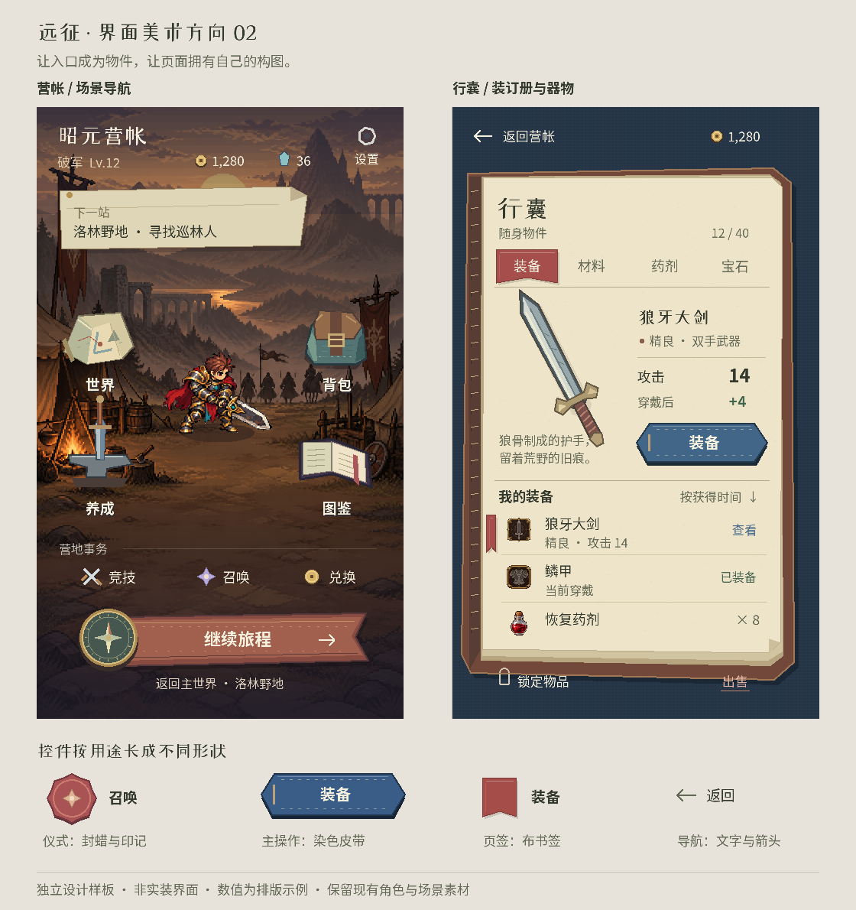

# 《远征》界面美术方向 V2：场景、器物与行旅册

日期：2026-10-03。状态：可评审的设计提案与独立 Godot 样板，尚未接入正式菜单。

用户反馈：按钮全是方框，颜色重复，界面缺少精致感，AI感重。本版取代第一轮“深青底、暖纸面、统一控件”的视觉方向；保留现有游戏内容、页面入口和交互协议。

## 1. 这次需要改变什么

第一轮的问题是把三个页面都组织成相似的纸面、色块和按钮。它能整理信息，却没有建立游戏自己的美术语言。当前正式界面的木牌也存在同样的问题：背景、按钮底板和标题都在重复一种装饰。

新方向为“有手作细节的像素奇幻行旅”。页面由场景和器物组织：营帐可以找到地图、行囊、训练工具和书；背包打开装订册；技能沿职业纹章展开；商店呈现货架和账单；对话由人物和短笺承载。玩家一眼能认出自己到了哪个功能。

精修依次处理：**页面构图 → 控件轮廓 → 插画和材质 → 字体排版 → 状态反馈**。仅改变色值、加圆角、叠金边、统一加噪点都不能作为完成依据。

## 2. 已制作的两张样板

| 样板 | 具体改变 | 后续正式接入时必须补齐 |
|---|---|---|
| 营帐 | 原场景与破军角色保留；地图、背包、养成工具、图鉴各自成为独立物件；竞技、召唤、兑换收成轻量入口；设置在固定角位；旅程操作采用指南针与布旗 | 物件按角色和场景的像素密度细画；完整可点击区域、焦点、状态、动效；真实任务与四种资源展示 |
| 行囊 | 蓝色织物衬底、皮革装订、分层纸边；布书签表示选中分类；武器大图与属性并排；清单用间隔和细线组织；装备突出，锁定与出售降低权重 | 接回 BagPanel 的筛选、列表、滚动、比较和确认；不同物品的大图与空态；满背包、长名称、装备锁定、库存变化 |

样板以 480×800 逻辑尺寸在 Godot 中实际绘制并导出，文字使用项目已有字体。场景、角色和清单小图标来自现有资源；地图、背包、书、指南针、武器大图等由代码绘制为设计样板。物件目前是造型与色块研究，最终像素细画、光照和所有状态仍需制作。

样板里的物品介绍、等级、资源与比较数值为排版示例，不是新的装备数据，也不是读取某份玩家存档得到的状态。它不连接正式页面、不处理实际游戏操作。

文件：

- `shots/ui_art_direction_v2_20261003/art_direction_board.png`
- `shots/ui_art_direction_v2_20261003/camp_480x800.png`
- `shots/ui_art_direction_v2_20261003/bag_480x800.png`
- `tools/PreviewUIArtV2.gd` / `.tscn`，用于复现此设计板。

## 3. 按钮和导航按用途设计

| 用途 | 推荐造型 | 行为与制作要求 |
|---|---|---|
| 营帐功能入口 | 地图、皮包、书、训练工具等场景物件 + 常驻文字名称 | 物件轮廓有区别，点击区至少44px；名称在触屏上直接可见；场景中的其他装饰不伪装为可点击入口 |
| 继续旅程 | 指南针与布旗组合 | 屏幕上最明确的一项主操作；方向箭头、文字与图案共同表达前进；布旗有卷边、褶皱和连接关系 |
| 装备、升级、购买 | 染色皮带或织带，局部扣件 | 共用一套动作按钮家族，按页面采用有理由的色彩；细节集中在边缘和连接处；字面区域安静 |
| 分类页签 | 布书签、夹页、页边签 | 只有选中项显示完整书签；其他项主要是文字，选中同时有位置或符号变化 |
| 召唤、仪式 | 封蜡或圆形纹章 + 明确文字 | 只用于仪式操作，纹章与对应系统有关；不能把所有按钮都改成圆形 |
| 返回、查看、锁定 | 箭头/小图标 + 文字，通常没有大底板 | 返回位置固定；文字稳定；鼠标、键盘和触摸可用；保持足够的实际命中范围 |
| 出售、分解 | 小面积朱印或明确文字 | 与主操作拉开距离，保留现有确认；颜色之外还有名称和确认上下文 |
| 战斗指令 | 剑柄、技能纹章、药瓶、足迹组成的四项指令组 | 使用相同字级、间距和点击尺寸，各项图形不同；技能快捷项有名称，药剂显示数量；不绘成四块同款大金条 |

统一的是字体规格、信息层级、边缘尺度、反馈和点击规则。不同控件的轮廓要与功能有关，不能为追求变化随意制造新风格。

按钮需要正常、悬停、按下、禁用、焦点五种状态。按下时底部厚度减少约1–2px、扣件或纸边轻微位移，文字保持整数位置，不缩放字形。焦点使用小角标或清楚的外轮廓；禁用同时说明缺少的材料或条件。不要让亮边和粒子覆盖文字。

## 4. 色彩要跟着世界和材质走

色彩由光照、场景、物件材质和功能共同决定。常规纸上阅读保留稳定的深色文字；页面的插画、布料、封面、物品和环境光提供变化。不要把所有页面都套进同一块青底或褐底。

| 场景/页面身份 | 主环境色 | 可见的材料与点色 |
|---|---|---|
| 昭元营帐 | 暮色紫灰、火光橙、土褐 | 朱红布旗、青绿皮包、旧铜扣、米色地图、冷铁训练工具 |
| 港口商店/任务 | 海蓝、石灰白、灰青 | 靛蓝帆布、海绿玻璃、珊瑚红小章、黄铜零钱、蓝灰木板 |
| 霜关记录/兑换 | 冷灰、雾蓝、浅紫 | 银色扣件、酒红封蜡、旧白纸、灰紫织物；文字区域保持足够对比 |
| 行囊 | 靛蓝织物与暖纸形成对照 | 赤褐皮脊、红色选中书签、蓝色装备织带；武器、甲胄、药瓶呈现各自颜色 |
| 技能 | 职业纹章与技能插画 | 破军铁灰/朱红，穿杨松绿/皮革，霜语冰蓝/浅紫，辰星深蓝/星金；数值对比仍遵守统一语义 |

同一屏通常保留一个明确主色、若干自然材料色和少量功能强调。色彩数量由物件内容决定；主文字、治疗/收益、危险、选中等语义保持稳定。重要状态必须同时有文字或图形，不能只有染色。

## 5. 各页面需要自己的构图

| 页面 | 核心构图 | 需要避免的重复 |
|---|---|---|
| 营帐 | 角色与环境是主体，主要导航成为四个有分量的物件；活动与系统入口较轻 | 八个等大的木牌、每个功能都套图标槽、标题与菜单另悬一块大匾 |
| 背包/装备 | 物品大图、整齐属性、清单册页；比较直接贴着当前属性 | 所有行都套框、物品只占一个小角、装备/锁定/出售同样突出 |
| 技能/养成 | 职业纹章与技能插画占据可辨认的位置，技能名称导航明确；具体变化按列呈现 | 大空白、无名称分页圆点、进度珠子成为全屏主体、层层套卡片 |
| NPC对话/任务 | 立绘适度越过纸笺边缘；人物名字清楚；对白、目标、奖励有阅读顺序 | 大木匾覆盖场景、对白和任务说明各铺一次同样的正文、选项全部做金条 |
| 商店/加工 | 货架或工坊器物提供身份；商品清单与账单保持易读；购买总价集中显示 | 每件货物都变成一张大卡片，每个价格都变成巨大金按钮 |
| 世界/图鉴 | 折叠地图、地域徽记、素描册页；未探索和完成状态明确 | 世界列表与背包一模一样、所有物件固定同一色框 |
| 战斗 | 顶部敌人血条与预兆；中段动作空间；底部四项有图形身份的指令 | 阶段横幅穿过战场、所有名字同时抢眼、指令变成四个等重矩形 |
| 设置/登录 | 清楚的分区和文字；登录以世界氛围与字标建立入口感；设置保持安静 | 把普通设置也装成一整套华丽物件，牺牲可读性和操作效率 |

战斗继续遵守已确认的我方在左、怪物在右。近战保留接近、命中、回位；修饰围绕落点尘土、刀光轮廓、命中火花和短暂停顿组织。首领预兆移到上方稳定位置，避免遮挡人物移动。特效的颜色由技能和敌人类型决定，不能所有技能都是同款金色光圈。

## 6. 字体与精细美术要求

操作和数值保持清楚的黑体，正文18px左右，短辅助信息16px左右，数值按列对齐。页标题允许少量有性格的显示字，保留正常字距；不把所有文字变成厚描边金字。标题、按钮、正文之间依靠大小、字重和位置建立关系。

本次样板使用现有 Noto Sans SC 常规/粗体，以及已有的站酷小薇显示字。小薇仅用于短标题，没有替换正式游戏字体。正式字体样板还要比较标题字形、文楷对白与当前字体；不能凭字体名称宣布效果已经改善。[站酷小薇官方字体目录](https://github.com/google/fonts/tree/main/ofl/zcoolxiaowei)

对白/书信建议试排霞鹜文楷屏幕阅读版，先用长句、多笔画字、角色名字和真实小窗口核对。它的官方项目将屏幕阅读作为用途，采用SIL OFL1.1；接入时保留字体版权与许可。[霞鹜文楷屏幕阅读版](https://github.com/lxgw/LxgwWenKai-Screen)

字体抗锯齿、hinting、纹理过滤和位置精度分别检查。角色与地图的最近邻采样策略不应因字体调整整体改变。使用真实窗口比较1×、1.25×、2×，再决定设置；文档中的参数解释不能替代实际截图验收。[Godot字体文档](https://docs.godotengine.org/en/stable/tutorials/ui/gui_using_fonts.html)

正式美术需要遵循以下细节：

- **轮廓**：在最终显示尺寸下修正物件外形，建立固定像素密度；不要把低分辨率图任意缩放到每个大小。
- **光照**：营帐受火光影响，册页、金属、布料有一致受光方向；凸起、折边和接触位置有局部阴影。
- **材质**：皮革裂纹靠折叠和磨损边；布纹顺着织向；纸的压痕、层叠和装订有原因。读字的中心区域减少纹理。
- **连接**：指南针与旗带、书签与页边、金属扣与皮带之间存在遮挡和连接结构；装饰不会随机漂浮。
- **插画**：给核心装备、职业、地域和任务制作有辨识度的图形；详情里使用大图，而非放大有边框的小图标。
- **克制**：同屏装饰有主次。光效、破边、纹章、铆钉、阴影不能每个控件各叠一次。

## 7. 实施顺序、落点与验收

**第一批：营帐与行囊。** 先把本版两张样板接成正式页面。制作四个营帐物件的像素成稿、旅程指南针/布旗、册页/皮脊/书签与动作织带状态；接回原入口、数据与滚动。字体使用真实名称和长文本校验。这两页覆盖场景导航与密集数据，最能检验是否摆脱模板感。

**第二批：NPC对话与战斗。** 人物立绘、任务纸笺、奖励清单与战斗指令分别成型；我方左/敌方右、移动命中、目标与阶段提示均在真实战斗里验收。

**第三批：技能、世界、图鉴、商店与其余菜单。** 共享交互规则，分别沿职业纹章、地域地图、图鉴册、商店货架组织。登录/设置最后整理。不可把所有页面重新套进同一张背景或同一款纸板。

代码落点保持现有 `GameHome.gd`、`BagPanel.gd`、`SkillBookPanel.gd`、`CityScene.gd`、`BattleScene.gd` 入口。颜色、字体和控件状态集中在 `src/ui/` 的主题与专用控件；通过 `G.gd` 原工厂接口逐步接入。物件入口仍复用现有打开页面的处理，皮带、书签、封蜡只改变呈现和状态反馈。正式替换前逐项核对旧函数调用，避免全局换皮后破坏固定尺寸或弹层。

验收要求：

1. 480×800与480×1067原尺寸截图检查；长屏增加可见内容，主要操作不漂移、字号不随意等比放大。
2. 营帐四个主入口与三个活动入口、角位设置及旅程操作都可发现；真实任务入口与全部现有资源仍可访问。
3. 分类、装备、锁定、出售、确认、滚动与返回使用真实输入验证；每种按钮状态可见；存档字段和奖励不变。
4. 背包空态、容量已满、超长名称、无货币、无材料、禁用、满级、已有装备和已锁定分别截图；不足信息不能只变灰。
5. 原角色与新物件的像素密度、脚下接触阴影、布旗连接、装备大图质量与文字清晰度分别评审。代码运行成功不代表美术通过。
6. 对话不遮住人物身份，战斗中段留出接近命中的动作空间；闪光和阶段说明不长期遮住敌人。

## 8. 本次验证边界

独立样板在项目内隔离APPDATA下启动Godot，输出总板及两张480×800图片；已按图核对正文、标题、列表、控件轮廓与营帐入口。没有本次新增的GDScript解析/脚本错误，进程退出码为0。

引擎退出阶段仍输出1个GL纹理RID泄漏及对应RenderingServer清理诊断；本次没有修复或将其称为美术验收成功。由于未改正式菜单，本次未进行正式菜单交互和全游戏回归，也未验证长屏。实施后的截图、真实输入与回归需另行记录。
