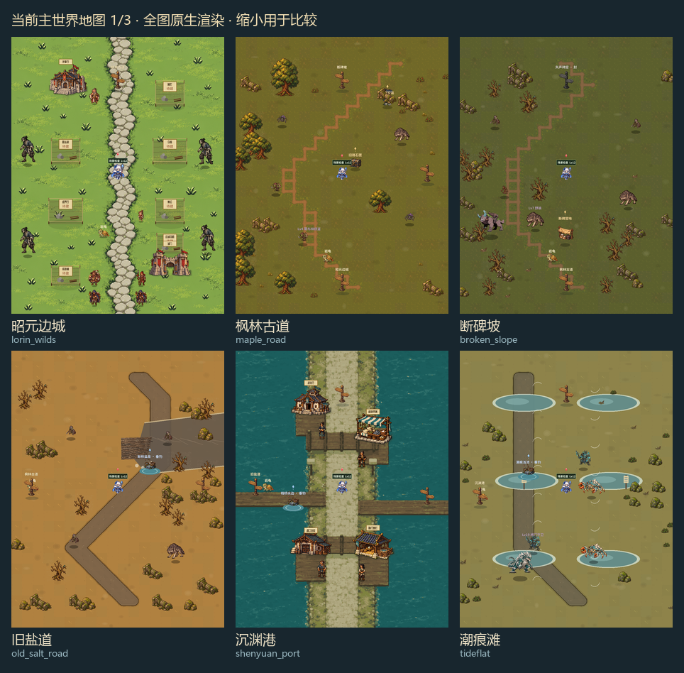
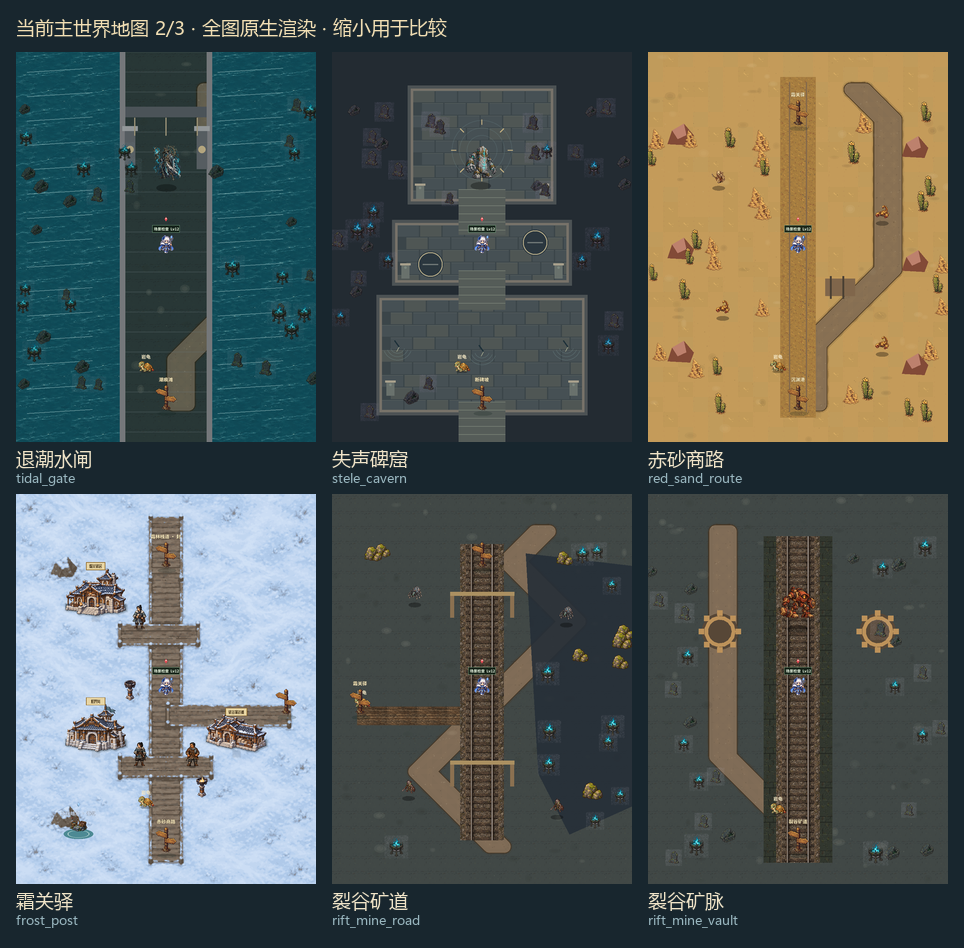
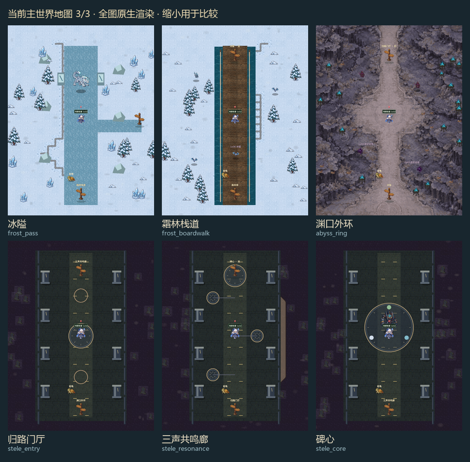
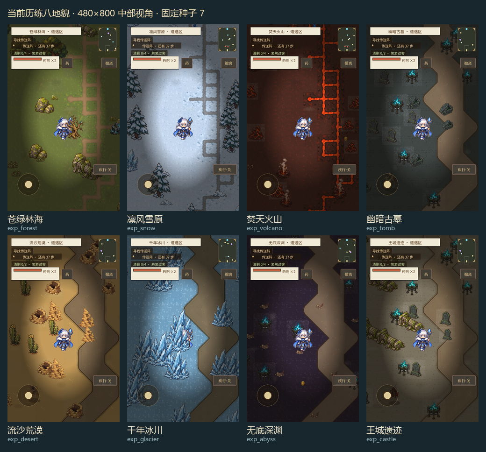
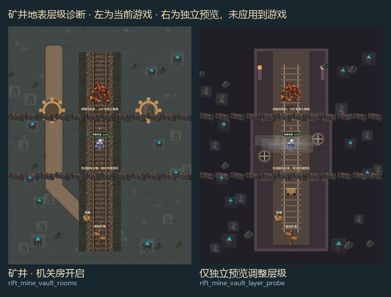

# 地图背景问题审查与修改方案

日期：2026-10-05。对象：当前工作区中的 18 张主世界地图、8 套历练地貌，以及用户提供的断碑坡截图。

## 判断与推荐顺序

当前背景的主要问题是地形结构、道路和绘制层级不统一。三块低差异地砖加地区染色，难以形成区域身份；多张专用地形又叠着通用随机土路；部分已完成的机关地面被底图遮住。优先修正这些问题，再补美术，能避免重绘后继续出现路线错位、双重道路和内容不可见。

建议顺序：**修正地表显示与配置 → 断碑坡、枫林古道两个样板 → 盐道与潮滩 → 雪地与矿井 → 终章地图 → 历练八地貌**。已有较完整底图的昭元边城、沉渊港、霜关驿、渊口外环，以局部修整为主。

本次产出为审查、截图证据和修改方案，未修改正式地图代码、配置或美术资源。

## 检查依据与范围

- 当前版本重新渲染：18 张主世界各取出生点短屏、中部短屏、中部长屏和全图；8 套历练地貌各取出生点、中部和全图，共 96 张。
- 补查 6 种状态：矿井机关开启、通风获救；水闸积水、栈桥通路、暗渠通路；碑心点亮，共 24 张。
- 另有 4 张矿井层级诊断图。诊断仅在独立预览实例中将矿井地面层级调整为 0，用于确认遮挡原因，未应用到游戏。
- 手机视口为 480×800、480×1067；主世界全图为 960×1248。长屏使用重新创建的场景，保证 HUD 按实际长屏尺寸布局。对照图缩小展示，判断细节使用原始截图。
- 隔离演示档，固定种子 7；未写入玩家存档。历练只抽查一个种子，机关状态通过演示档设置，截图不等同于完整流程、通行或真机测试。
- 本机可用引擎为 Godot 4.6.1，项目声明 4.7。最终截图无脚本解析或运行错误；日志存在证书、缓存写入及退出资源清理告警，仍需在目标引擎和手机上验收。

证据目录：[完整截图与索引](../../shots/map_background_audit_20261005/)。实际加载素材包含 `refined` 自动替换，已记录于 [source_manifest.json](../../shots/map_background_audit_20261005/source_manifest.json)。

### 当前全图对照

## 共性问题与具体修改

| 优先级 | 已确认问题 | 修改方案 | 影响范围 |
|---|---|---|---|
| P0 | 裂谷矿脉机关房地面不可见。`MineRoomGround` 放在 `_world` 内并设为 `z_index=-1`，落在基础地面之下。独立预览将它设为 0 后，三房、风轮、烟尘和矿车立即出现。 | 为底图、地形细节、实体、前景建立明确层级；矿井机关地面放在底图上、人物下。重验通风和获救前后状态。 | 裂谷矿脉，兼查其他专用地面 |
| P0 | 通用路从底部中央随机走到顶部，不读取实际出生点、侧向出口和营地。旧盐道实际东西向通行，画面却是纵向折线路。 | 主世界道路改为按地图配置的固定路线；连接出生点、出口和关键地点。历练保留随机路线。 | 枫林古道、断碑坡、旧盐道、潮痕滩等 |
| P0 | 赤砂商路、矿道、霜林栈道、冰隘等叠着通用土路与专用地形，出现两套路线、残余阶梯和无意义岔口。 | 每图只指定一种主要地表生成方式；已有栈道、轨道或冰道的图停止绘制通用随机路。保留独立通行掩码用于摆件避让。 | 专用地形地图 |
| P0 | 地图显式配置 `decos: []`，仍被回退为主题摆件。截图出现水道中的墓碑/火盆、房间外黑底上的摆件。 | 区分“未配置，继承主题”与“空数组，不放随机摆件”；室内、水域和悬空外侧使用指定摆件区域。 | 水闸、碑窟、矿脉、冰隘、渊口外环 |
| P1 | 森林、雪地、熔岩道路套件是窄线连接素材；铺成双格带后仍形成空心方环、梯子和阶梯。 | 道路按连续区域填实；道路内部、外缘、转角和岔口分开处理。先检查套件每个连接状态，不能把同一窄线路块直接当宽路内面。 | 林地、雪地、火山及其主世界地图 |
| P1 | 三种 48×48 地砖差异小，随机铺设后仍是全屏同材质；整体染色把草地、石坡、盐滩变成同一地面换颜色。 | 地面增加大片材质分区，局部补边缘、落叶、碎石、泥线和积雪；地区颜色分别作用于地面与摆件。 | 多数程序铺地地图 |
| P1 | 水洼、冰面、悬崖、墙体和符阵仍是规整椭圆、矩形和线条，和细致角色、建筑的精度不一致。 | 保留现有地图结构，以统一像素素材替换可见轮廓和材质；补岸线、岩壁侧面、墙顶、桥侧及接触阴影。 | 潮痕滩、冰隘、碑窟、矿井、终章三图 |
| P1 | 少数墓碑/火盆存在矩形底块或抠图残留；狼、营帐等的落地影与可见脚底分离。 | 清理摆件透明边与杂点；按可见脚点设置图像、阴影和碰撞锚点。背景、怪物、道具分别校准，避免整图一起下移。 | 古墓摆件、野外营地、怪物 |
| P2 | 三张终章地图共享同一长方形大厅，主要区别只在圆圈、刻线和发光点。 | 保持同一建筑语言，分别加强门厅入口、三声侧区和碑心中央祭坛的构图与地标。 | 归路门厅、三声共鸣廊、碑心 |

P0 表示应在重绘前完成的结构修正；P1 为主体视觉改进；P2 为差异与精修。

## 18 张主世界的修改目标

| 地图 | 当前主要问题 | 确定的修改方向 | 优先级 |
|---|---|---|---|
| 昭元边城 | 新草地比野外清晰，但主街像独立串珠石路，两侧建筑入口和地面连接弱。 | 保留草地底图；补主街与建筑入口的短支路、门前压实地面和小广场；控制大石块尺度。未建地块按建设状态保留。 | P2 |
| 枫林古道 | 草地偏黄绿，枫林特色主要依赖零散黄树；道路折线及空环明显，东侧盐道出口缺少路面连接。 | 主路连南北出口，增加通向东侧出口的固定支路；加入红金落叶片区、林缘土面和成组树冠。与断碑坡使用明显不同的材质。 | P0/P1 |
| 断碑坡 | 用户截图中大面积橄榄绿噪点、半透明圆斑；枯树、野狼、营帐零散悬在平地上，“坡”和“断碑”不明显。 | 主体改为灰褐土石、苔痕与碎碑坡面；以现有碑点为主要地标，营帐增加小块压实地；道路连接营地与两端出口；圆斑换为有形状的碎石、苔斑与裸土。 | P0/P1，第一样板 |
| 旧盐道 | 出口在左右，通用路却纵向游走；断桥木板像贴上去的矩形，河床缺少体积。 | 以东西向盐运道路连接两个出口；保留断桥位置，补断梁、河床台阶、车辙和盐壳边缘。明确现有可走地面与地貌边缘的关系。 | P0/P1 |
| 沉渊港 | 已有完整水岸、石路和栈桥；水、石、木的清晰度略有差异，建筑前缺少局部使用痕迹。 | 保留底图与平台；统一木板、水面像素尺度，补桥头衔接、港口湿痕和建筑脚下阴影。侧出口路线保持清楚。 | P2 |
| 潮痕滩 | 六个水洼几乎对称排列，像椭圆标记；沙地偏干，旧土路缺少潮滩质感。 | 改为不规则浅水与连续退潮线；泥滩、湿沙、盐纹成片分布；道路从西入口转向北部水闸，补贝壳、海草与漂木群。 | P0/P1 |
| 退潮水闸 | 水道、墙和石路笔直且重复；随机土路仍露出，摆件落在水中；积水与通路状态变化偏弱。 | 清除通用土路和随机墓碑；用专用水岸、闸墙、石道构建场景。积水、退潮、栈桥、暗渠分别有明确水线与路面；机关动态继续独立绘制。 | P0/P1 |
| 失声碑窟 | 三房结构已清楚，但墙、砖和连接通道像平面示意；黑暗外侧仍散落墓地摆件。 | 保留三房和两道机关门坐标；替换墙顶、砖缝、门槛与碑座素材，补墙脚阴影、崩口和石屑。房内以固定摆件布置。 | P0/P1 |
| 赤砂商路 | 正中车辙路旁叠着另一条随机土路；红岩为几何块，商业道路特色薄弱。 | 保留中央商路与车辙，删除第二道路；砂丘、红岩和卸货点成组布置；补路缘积砂与货运磨损。 | P0/P1 |
| 霜关驿 | 雪地、栈道和建筑已有一致构图；雪面细节密，栈道入口到房屋之间偏空。 | 保留底图；补门口脚印、积雪边、火盆暖色接触光及栈道使用痕迹；降低重复雪面亮点。 | P2 |
| 裂谷矿道 | 铁轨与土路争夺路线；侧面裂谷是暗色多边形；矿口支架几乎只有线条。 | 铁轨作为主方向，西侧连接木桥；删除通用土路；补裂谷岩壁、轨道道砟、矿口梁柱、矿灯和固定废料堆。 | P0/P1 |
| 裂谷矿脉 | 机关房地面被遮挡，当前看到旧轨道和两个占位齿轮；修正层级后房间仍是简化矩形，摆件露在房外。 | 先修层级；以三房、双风轮、矿车和炉房结构作为唯一地面。再替换石壁、轨道、风轮、烟尘与矿车素材；获救前后保留可见差异。 | P0，优先处理 |
| 冰隘 | 冰面是巨大直角长条，侧向出口像矩形伸出；两侧岩体为三角形，占位感强。 | 保留中轴与东向出口；制作不规则冰道、雪覆岩壁、窄口地标和冰裂边缘。冰面、雪地与可走路肩清楚衔接。 | P0/P1 |
| 霜林栈道 | 木板像笔直长地毯，两侧取用港口水面，视觉更像运河；旁边还残留雪地阶梯路。 | 清除重复道路；将两侧改为雪谷或结冰溪谷，并配林缘、桥侧、栏杆、桥脚和少量覆雪；保留中轴栈道通行。 | P0/P1 |
| 渊口外环 | 岩壁底图较完整、路线清楚；与终章砖地在材质尺度上跳变，随机火盆/骨骸仍散在边缘。 | 保留岩壁构图；把摆件改为指定点位；统一入口石材、冷暖色和像素尺度，在现有门厅出口补过渡地标。 | P0/P2 |
| 归路门厅 | 同一大厅与另外两图近似，门厅入口特征不足。 | 强化入口门框、归路锚点、两侧残碑与方向铺装；中央通行保持清楚。 | P1/P2 |
| 三声共鸣廊 | 三个机关主要靠小圆圈和颜色区分，空间本身近似门厅。 | 为三处机关补森林、潮汐、霜雪的局部地面纹样与侧区地标；刻线与符阵按状态独立点亮。 | P1/P2 |
| 碑心 | 中央大圆阵与细致首领精度不一致，终点空间辨识度弱。 | 保留首领与祭坛位置；强化中央祭坛、断裂同心石环、柱群和三声汇合纹样，减少周围细碎噪点。 | P1/P2 |

## 历练八地貌

| 地貌 | 当前问题 | 修改方向 |
|---|---|---|
| 苍绿林海 | 阶梯/方环土路、地面均质。 | 连续填实土路，草地/腐叶/树根成片，林缘摆件成组。 |
| 凛风雪原 | 空环雪路、反复左右折返，雪面均质。 | 使用连续压实雪路；积雪、冰斑、雪松边缘形成大块变化。 |
| 焚天火山 | 熔岩套件像亮色空心梯子，与通行路线关系不清。 | 分清现有可走岩面与熔岩视觉，补火山石路肩和暗红裂隙；沿用现有灼热规则。 |
| 幽暗古墓 | 通用褐色路像野外泥路，墓碑和火盆底块突兀。 | 道路改为连续残损石砖；清理透明底，补墙基与墓室石材。 |
| 流沙荒漠 | 宽褐色路像硬带，井、仙人掌和石堆均匀撒开。 | 道路融入踩实沙面，补风纹和小沙丘，摆件围绕少数区域成组。 |
| 千年冰川 | 仍铺褐色土路，大冰柱会遮住角色。 | 使用冻岩/压实冰雪路线；大冰柱移到通道边缘，按可见轮廓检查遮挡。 |
| 无底深渊 | 紫色底砖上叠褐色路，地域材质不一致。 | 通行面使用玄岩或符石，裂隙边缘与稀疏光点负责方向；控制暗角强度。 |
| 王城遗迹 | 与古墓共用土路、墓碑、火盆，王城特征不足。 | 主路换成损坏王城石铺面；增加墙基、柱座、旗台等区域资产，保留开放通道。 |

先修宽路呈现与材质，再抽查多个种子。视觉改造尽量保留现有路线坐标，避免同时改变随机局布局与存档恢复。

## 实施分批与交付

### 第一批：结构修正

1. **明确地表模式。** 每图配置程序地形、固定地形或整图底图；专用地面只保留一套。地形显示与通行掩码分开，取消随机路时不能顺带取消摆件避让。
2. **固定主世界道路。** 在配置中列出路径控制点，以现有出生点、出口和交互点为锚点。旧盐道先恢复东西向道路；枫林古道补东支路；断碑坡补营地连路。
3. **整理层级。** 建议底图 -20、地形细节 -10、人物及道具 0 并按脚点排序；前景单独管理，HUD 维持独立层。矿井机关房属于地形细节层。
4. **明确摆件规则。** 空数组表示无随机摆件；水面、室内外边界、路线和交互点设置可布置区域。装饰随机与玩法随机分开，防止美术增减影响遭遇分布。
5. **修正道路套件。** 先完成直路、转角、双格宽路、三岔和四岔的素材对照；移除空心内面。五种无套件地貌也要使用各自道路材质。

交付：18 张图不再有重复随机道路；矿井机关房及状态可见；显式空摆件配置生效；主要道路连接真实地点。以当前截图为基线保留前后对照。

### 第二批：两个视觉样板

**断碑坡先做。** 用灰褐土石、苔痕、碎碑和坡壁建立主题；做营帐地面、道路路缘及脚点阴影。优先复用已有枯树、营帐、怪物和路牌，新增地面与地标资产。

**枫林古道随后做。** 使用红金落叶、暖色林缘和连续土路；补盐道岔口。与断碑坡同屏比较，确认角色、树木、地面和道具的像素尺度一致，而两图材质与构图明显不同。

每个样板交付：960×1248 地表与地标布局、480×800/1067 同坐标实机对照、地图边缘与交互点细节、路线通行检查。由这两个样板确定后续颜色、纹理密度、路缘、落地阴影和摆件尺度。

### 第三批：区域推广

- 盐道与潮滩：盐壳/湿沙材质、自然水岸、断桥与闸墙模块。
- 雪地与矿井：雪覆岩壁、冰道、桥侧支撑、轨道道砟、矿墙和机关素材。
- 终章：同一石材体系，分别补门厅、三声侧区、碑心祭坛的地标与构图。
- 四张已有底图：只做入口衔接、局部地面、接触影和素材尺度修整。
- 历练八地貌：复用已验证的材质与道路模块，再验证随机布局中的连通与遮挡。

补图时将地面、固定建筑、可交互物和状态效果分别制作。机关、营帐、路牌文字和任务物不烘焙进底图，避免状态变化后出现重复物或残影。

## 验收标准

1. **道路和玩法一致：** 出生点能沿可见道路到达每个开放出口与关键交互点；地图路面、通行掩码和实际碰撞一致。一般主路净宽以 96～144 世界像素为目标，机关收窄处按原设计检查。
2. **地表层级正确：** 地形细节可见，角色站在其上；室内墙、桥侧和阴影有稳定顺序。矿井、水闸及符阵状态改变后，变化位置正确且读档可重建。
3. **自然材质成立：** 宽路没有连续空心方环；水洼没有机械对称椭圆；冰道、坡壁和石墙不以裸矩形作为最终轮廓；重复纹理不形成规则条带。
4. **角色易读：** 中央人物附近保持低噪点地面，大摆件不遮住站位与关键交互；狼、营帐、路牌脚底与阴影贴合；没有矩形抠图残留。
5. **区域可辨：** 隐去地图名后，能凭地面与地标辨认枫林、断碑坡、盐道、潮滩、雪林、矿道和终章空间。地区染色不把全部材质压成同一色。
6. **尺寸与像素稳定：** 整图底图按 960×1248 设计坐标对齐，特别检查边城现有底图的长宽比例。当前最近邻过滤已开启；仍需检查源素材、镜头缩放和移动时的像素稳定性。
7. **回归范围适当：** 两种手机比例，地图出生点/中部/出口/全图；矿井和水闸全部关键状态；历练至少 3 个种子。检查新旧存档位置、自动寻路、碰撞、机关与同图战斗地表继承。

## 实现位置与证据

- [地表染色、底图与地砖](../../src/explore/MapScene.gd)：`_ground_tint`、`_build_ground`。
- [通用道路、摆件与矿井层级](../../src/explore/MapScene.gd)：`_build_ground_detail`、`_path_cells`、`_build_decos`、`_build_mine_rooms`。
- [主世界地图配置](../../data/main_world_maps.json)、[八地貌配置](../../data/maps.json)。
- 专用地面：[盐道](../../src/explore/SaltRoadGround.gd)、[潮滩](../../src/explore/TideflatGround.gd)、[水闸](../../src/explore/TidalGateGround.gd)、[碑窟](../../src/explore/SteleRoomGround.gd)、[第三幕](../../src/explore/ThirdActGround.gd)、[矿井机关房](../../src/explore/MineRoomGround.gd)、[终章三图](../../src/explore/FourthActGround.gd)。
- [短屏第一组](../../shots/map_background_audit_20261005/world_phone_1.png)、[第二组](../../shots/map_background_audit_20261005/world_phone_2.png)、[第三组](../../shots/map_background_audit_20261005/world_phone_3.png)。
- [长屏代表地图](../../shots/map_background_audit_20261005/representative_long_phone.png)、[机关状态对照](../../shots/map_background_audit_20261005/state_overview.png)、[地砖素材对照](../../shots/map_background_audit_20261005/terrain_source_gallery.png)。
- 矿井层级诊断：[当前机关房状态](../../shots/map_background_audit_20261005/overview/rift_mine_vault_rooms.png)、[仅在独立预览调整层级后](../../shots/map_background_audit_20261005/overview/rift_mine_vault_layer_probe.png)。

