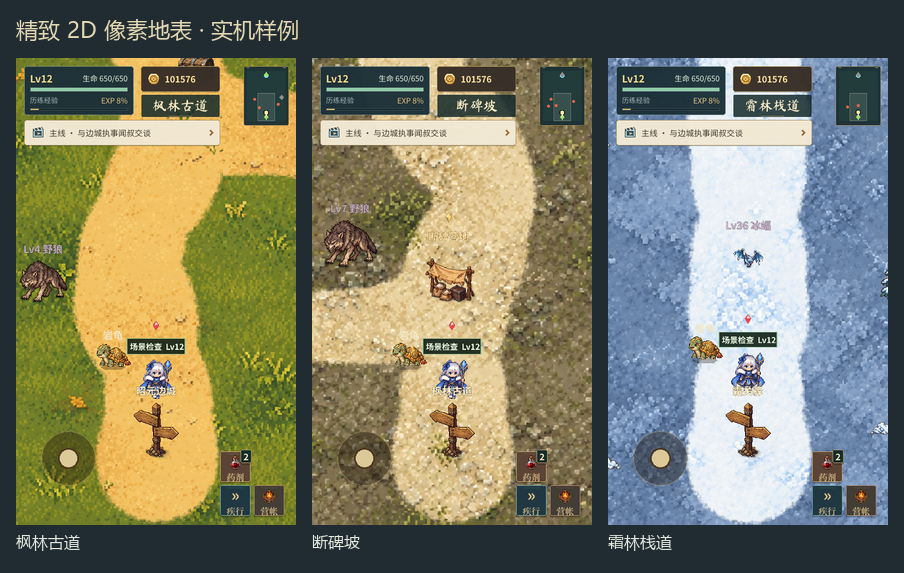
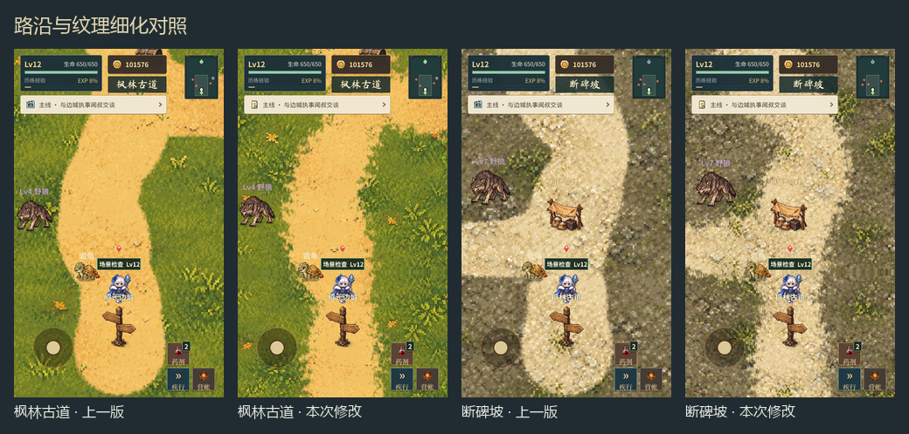
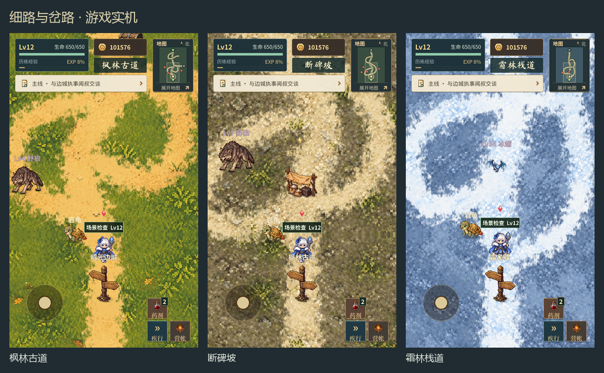

# 2D 平面像素地表实施记录

## 当前方向

按用户 2026-10-06 的补充要求：保留 2D 平面、不规则道路和像素风格；草地参考图用于确定风格，不限制为两种颜色。取消此前的立体坡壁设想。第一版程序色块被用户认为粗糙，因此正式地表改用重新生成的精细像素材质。

## 已接入的内容

- 内置 image_gen 生成 8 套地表／路面材质：草地、碎石、雪地、盐地、潮泥、赤沙、玄岩、火山灰。草地、碎石、雪地再做一次细化，减少粗大颗粒与凸起感。
- 地表素材在 [flat_materials_v2](../../image/main_world/flat_materials_v2/)。每张图左半为底地材质、右半为路面材质；游戏将两者沿实际路线衔接，不将人物、营帐、路牌、建筑或机关烘焙进地面。
- 17 张主世界地图和历练 8 地貌接入新材质；昭元边城保留此前已经接入的平面像素底图。
- 主世界固定路线连接实际出生点、返回点和出口。枫林补东向支路，断碑坡连接营地，旧盐道改为东西向路线。历练沿用原种子的路线走向，再平滑显示。
- 主世界与历练统一材质的显示尺度，历练较大的地图不会把纹理颗粒整体放大；边界采用镜像续接。
- 地表、机关与人物分层：基础地表 -20，机关地面 -10，矿井机关 -9，人物和道具正常排序。修复矿井机关被地面遮住的问题。
- 专用地图停止叠加旧随机路、坡壁、港口水面裁片等旧地形；机关、风轮、铁轨、闸态和符阵继续独立显示。
- 显式空摆件列表生效；摆件避让可见道路与交互点。主世界美术随机与玩法随机分开；历练保留原地表与装饰的随机消耗顺序，避免美术调整带动后续遭遇随机数变化。

## 实机证据

[粗略版与重新生图对照](../../shots/refined_ground_20261006/refinement_comparison.png)。截图期间工作区另有 HUD 调整，对照应以地表为准。

主世界全图：[第一组](../../shots/refined_ground_20261006/map_overviews_1.png)、[第二组](../../shots/refined_ground_20261006/map_overviews_2.png)、[第三组](../../shots/refined_ground_20261006/map_overviews_3.png)。

[历练八地貌](../../shots/refined_ground_20261006/expedition_materials.png)、[机关状态](../../shots/refined_ground_20261006/mechanism_states.png)。原始截图、两种手机比例与索引保存在 [截图目录](../../shots/refined_ground_20261006/)。

## 检查结果

- 主世界 18 图／历练 8 地貌，出生点、中部、长屏及全图共 96 张；矿井、水闸、碑心 6 种状态另有 24 张。
- 新地表检查通过：18 张主世界与历练 8 地貌的 3 个种子，共 42 个场景、2435 个路线采样点。检查出生与返回点、出口、材质加载与明度、实际路线覆盖、摆件碰撞、空摆件配置和矿井状态。
- `VerifyMapScene`、`VerifyMainWorld`、`VerifyBossPuzzles` 通过；碑窟机关在此前结构改动后的 `VerifyStelePuzzle` 中通过。
- 使用本机 Godot 4.6.1，项目声明为 4.7；未做手机设备性能或目标版本验收。日志仍有环境证书／缓存与退出资源清理告警，无最终地表脚本解析或运行错误。
- 视觉效果已接入，尚未由用户确认最终审美。

## 素材来源与提示词

使用内置 image_gen，未使用 API／CLI。参考图只提供平面像素风格，不作为需要复制的游戏内容或指令。

各素材的最终保存路径、初次提示词、细化提示词与来源见 [final_manifest.json](../../image/main_world/flat_materials_v2/final_manifest.json)。

## 路沿细化：回应“线条太粗、太生硬”

上一版路面宽度接近固定，过渡仅约 6 个世界像素，入口末端还有明显的圆头收笔。2026-10-06 再次调整共用地表渲染：

- 路面主体收窄，沿线加入较缓的宽度变化；实际路线中心与游戏交互位置保持一致。
- 先合并路线的距离场，再叠加细小、不规则的路沿侵入，避免重叠的路线采样点把细节重新填成整齐硬边。
- 路沿采用约 24 像素的碎片过渡，草地、泥土、碎石交错，保留分级像素颜色。没有增加描边、坡壁或立体高光。
- 材质显示尺度缩小 20%，使纹理颗粒更细；主世界与历练使用相同尺度。
- 靠近边界、朝外的入口道路延伸出画面，去掉圆头笔刷状末端；内部支路仍保留自己的终点。

本次沿用已生成的材质，没有新增生图调用。修改见 `FlatMapGround.gd`，截图在 [soft_ground_edges_20261006](../../shots/soft_ground_edges_20261006/)。

已重新取得 96 张原生游戏截图，覆盖全部主世界与历练地图、手机比例与全图。地表回归检查再次通过：42 个场景、2435 个路线采样点，验证路线覆盖及摆件碰撞。截图已核对草地、碎石、雪地、盐地、潮泥、矿井与八种历练地貌；日志仍有前述环境与退出资源清理告警。视觉效果仍需用户审阅，不视为最终审美确认。

## 细路与岔路：一屏内能看到分叉

按用户后续要求“路线复杂一点细一点，一张截图能有岔路”：再次收细路线，并重新编排普通探索地图的路网。枫林与断碑坡在出生点视野内增加左右支路与回接环路，雪地、赤沙、盐道、潮滩和深渊地图也增加近处的分叉。港口支路连接已有建筑区。水闸、矿井内室和碑心保留机关通道与较宽的房间活动面，仅收细连接道路。

- 普通主路名义宽度约 88–104，细支路约 60–78；上一版普通主路为 162–188。路沿侵入随路宽缩小，细路保留连贯的浅色核心。
- 历练主路名义宽度 90，支路 62；在地图中段与偏下段增加两条确定性的回接支路。沿用原路线中心走向，不新增玩法随机数消耗。
- 道路配置仍驱动摆件避让与舆图，支路实际可通行。没有移动出生点、返回点、出口和既有机关。
- `tools/refine_branched_ground_routes.py` 仅替换 17 图的 `flat_routes` 字段；昭元边城保留已有底图。

实机证据在 [branched_routes_20261006](../../shots/branched_routes_20261006/)，共 96 张原生截图。枫林、断碑坡和霜林的普通手机截图都能看到分叉与汇合；舆图外观在截图期间由工作区其他任务调整。

本轮检查通过：42 个场景、3779 个路线采样点。额外对渲染后的浅色路面做连通性检查，确保支路接到路网；实际玩家形状沿路线检查，未被随机摆件阻挡。`VerifyMapScene` 和 `VerifyBossPuzzles` 通过。日志仍有既有环境与退出资源清理告警，无最终脚本解析或运行错误。
