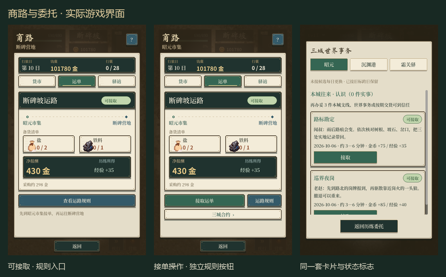

# 行旅面板精修

按商路截图反馈：增加配色层次，区分规则与操作按钮，优化订单布局，将“可接取”做成椭圆标志。后续 HUD 八项建议在另一条正在进行的界面任务中已有修改，本轮沿用其漆木、黄铜与纸签配色，未覆盖 WorldHUD、MapScene 或 CityScene 的并行工作。

## 接入内容

- 新增 `src/ui/LedgerStyle.gd`，共用漆木、黄铜、羊皮纸、边缘高光、硬影与克制的边缘纹理。
- 商路三个页签和帮助页接入同一套按钮与卡片。深绿为主要操作，墨蓝为规则/条款，浅纸为次级入口，暗木为返回。接单/交货时独立显示规则按钮，原有业务条件保持不变。
- 运单分为标题、路线、带图标的货物小卡、报酬区与期限说明。数字采用黑体，正文采用宋体，页面标题保留书法字体；优先保持小字号中文完整可读。
- “可接取”绿色、“运送中”蓝色、“已逾期”赭红；同时保留状态文字，避免只凭颜色区分。已完成、未解锁、退单等也有对应标志。
- 霜关药单、三城合约与世界委托接入同一套卡片和椭圆标志；退单用赭红次操作，委托页签显示当前选中项。原有金额条款、退单确认、期限、滚动和交易处理保留。

## 实机证据

[前后对照](../../shots/ledger_refinement_20261006/before_after.png)、[状态对照](../../shots/ledger_refinement_20261006/status_states.png)、[同类面板](../../shots/ledger_refinement_20261006/related_panels.png)。

`shots/ledger_refinement_20261006/` 保留 44 张原生截图：商路、帮助与交互过程检查，以及带地图背景的 9 个面板/状态 × 两种手机比例。截图拼版只用于审阅，没有修改游戏截图内容。面板截图索引见 `panel_capture_index.json`。

## 验证

- Godot 4.7.2 实机截图；9 个面板/状态的 480×800 与 480×1067 共 18 张做文字检查，420 个文字节点未发现采样、过小艺术字或文字框高度不足。
- `CaptureLedger` 检查 5 个交易点的三个页签和帮助页布局，并实际验证失败交易不扣钱、买入、卖出、差事、换日和订单状态，输出 `TRADE_SHADOW_OK`。
- `run_regression.ps1` 的最终 7 项通过：VerifyTradeWorld、VerifyFrostHerbOrder、VerifyTradeContracts、VerifyTradeContractsRead、VerifyWorldCommissions、VerifyWorldCommissionsRead、VerifySafeArea。存档读回用例与创建测试配对执行，最终日志在 `verification_final/`。
- 既有 Windows 证书与退出资源诊断仍记录在日志中；无最终 UI 脚本解析或运行错误。未进行手机设备性能验收。

未生成新的栅格美术素材，也未接入新的字体资产。本轮修改限于原生 UI 布局与绘制；最终视觉由用户审阅。
