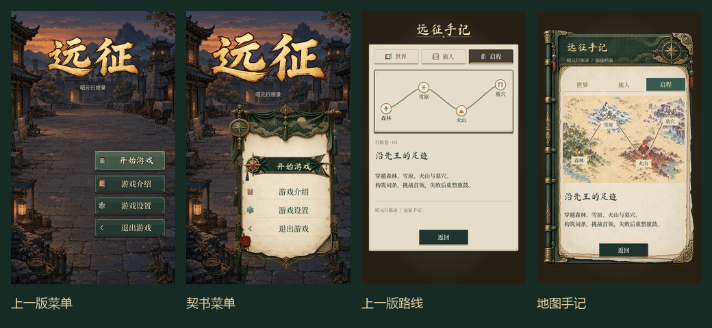

# 行旅契书 UI：构图与美术重做

用户认为上一版缺少设计感，要求研究游戏界面、多用生图、接入后反复截图和验证。本轮不把边框更换等同于整体设计，集中重做主菜单、登记、手记与营帐的主操作入口。

## 参考与判断

- [Hades 主菜单参考](https://interfaceingame.com/screenshots/hades-main-menu/)与[开发团队 UI 美术工作说明](https://www.supergiantgames.com/blog/3/)：学习强烈的视觉锚点、插画式界面构件、成套图形语言和可动效化的分层资源。只提取方法，未复制游戏素材。
- [Sea of Stars 官方展示](https://store.steampowered.com/app/1244090/Sea_of_Stars/)：参考像素游戏中场景、角色与界面之间的层级关系。网站资源没有接入本项目。

我的设计判断：上一版等宽矩形重复过多，纸页只是背景色块，插画与正文上下机械排列，缺少内容自身决定的构图。新方向为“行旅契书”：精细册页、黄铜构件、丝织选中带、地图插画，与本作青绿、旧金、朱印的配色呼应。

## 资产与落地原则

内置 image_gen 生成契书、主按钮、册页窗口、行旅地图四组可用资产。文字、输入框、可点击区域和游戏数值继续由原生控件绘制。按游戏实际截图检查资产与文字的关系，避免把整屏概念图当作完成的游戏 UI。

## 已采用版本

- 主菜单：新的悬挂契书承载操作列表；启动操作为丝织印牌，其余功能用文字导航。放大品牌标题，取消多余的契书题头，避免文字与缨穗竞争。
- 登记/头像页：装订册页承载原生表单。左边距按书脊重新校准，缩短输入框与操作宽度，保留上传、自定义头像与存档兼容。
- 行旅手记：册页题头、紧凑页签、图文叠排的世界页、两列旅人阵列、带插画地貌的路线页；原路线动画继续使用原生绘制。
- 营帐：继续旅程入口采用同一套丝织印牌，重新调整高度与两行文字位置。
- 绘制时只拉伸安静的纸面和织物中心，头部、边件维持比例。低透明度阴影不参与主体显示范围，避免按钮被挤成细线。

全部为内置 image_gen 生成，共四项原创栅格资产；没有使用 API/CLI。保存目录为 `image/ui/designer_20261007/`，各文件、完整提示词和来源见 [generation_manifest.json](../../image/ui/designer_20261007/generation_manifest.json)。文字没有烘焙进素材。

## 截图复查

第一轮发现按钮主体被外围阴影撑小、装订边遮文字；第二轮校正显示范围与内容边距；最后移除叠在缨穗上的重复标题、调整主入口文字与高度，并重新录制、验证。

[总览](../../shots/designer_ui_20261007/overview.png)、[手记三页](../../shots/designer_ui_20261007/journal_pages.png)、[长屏](../../shots/designer_ui_20261007/tall_screens.png)、[实际渲染动画](../../shots/designer_ui_20261007/motion_preview.gif)。

最终 20 张原生截图覆盖 480×800、480×1067；两段动画共 60 个实际渲染帧。256 个文字节点检查没有发现采样、过小艺术字或文本框高度问题。图片拼版仅用于审阅，不改变游戏内容。

## 验证结果

Godot 4.7.2，最终 VerifyUiLayout、VerifyGameHome、VerifySafeArea、VerifyPerf、VerifyAvatar、VerifyNav 六项通过。日志位于 `shots/designer_ui_20261007/verification_final/`，没有放宽性能预算。

最后截图和动画录制无脚本/着色器错误；原有证书和退出资源清理诊断仍记录在日志中。未进行实体手机设备性能验收。当前设计由实际画面审阅判断，最终审美仍可按用户意见调整。
