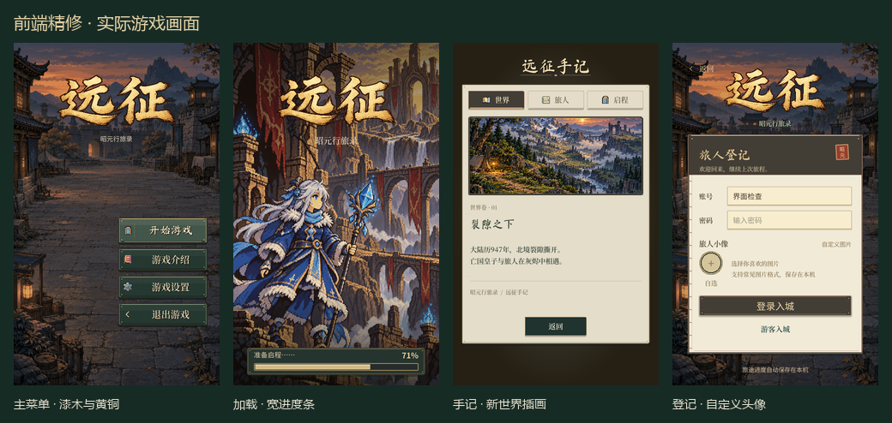

# 前端 UI 审阅与迭代

## 截图问题与方案

- 主菜单：木纹纹理已生成，但按钮绘制只用了平涂色；按钮与品牌文字缺少材质呼应。改用完整漆木、黄铜包边、短硬影、内亮边与按压反馈，保留明确的主次操作。
- 加载：288×8 的进度条过细，阶段文案与百分比混在一起。扩宽、加厚，给进度信息留独立区域，保持真实比例。
- 营帐：经验条同样过细；头像来自宠物战斗素材，火焰、异色眼睛和复杂细节不适合作个人身份标记。扩宽经验条；取消预设推荐，保留自定义图片，缺图时用安静的行旅标记。
- 品牌动画：现有代码只有 UV 横向擦除与透明度渐入。改成沿笔锋分段快速勾写，不循环闪光。
- 介绍：世界插画模糊，人物页与启程页仍像静态说明文档，页签下空白偏多。重新生成世界插画，强化内容分区，绘制曲折行旅路线并按路程顺序播放。
- 路牌：北口牌子移到 y=240，实际触发仍读 exits.at 的 y=96，造成视觉与操作不一致。统一牌子位置和接触区域，在牌子中部附近即可进入；保持剧情锁、机关锁、存档失败回退与返回点安全。

## 验收口径

逐轮从真实 Godot 截图与动画录制检查：主次清晰、字体完整、间距一致、内容不重叠、没有不可读插画或空占位；检验菜单、分页、头像上传与地图进入行为；检查普通手机和长屏。视觉结论是本轮设计判断，不将“成熟游戏 UI”表述为客观认证。

## 素材与结果

已完成三轮静态/动态审阅：第一轮调整整体材质与信息层级；第二轮收薄加载底板、添加地貌标记、整理头像入口；第三轮修复旅人原图撑大卡片的问题，并核对小字、长屏和动画。

- 菜单实际绘制漆木纹理，增加黄铜内边、短硬影、细小钉扣与按压/焦点变化；登记与上传按钮补充同类边缘细节。
- 加载条从 288×8 改为 384×18，阶段说明与百分比分开；底板收为 416×64，减少遮挡。营帐经验条从 116×4 改为 184×10。
- 标题使用原金色素材的分段笔锋显露，约 0.86 秒；属于快速勾写效果，不宣称严格还原汉字笔顺。素材裁区与着色器缓存跨页面复用。
- 世界、旅人、启程三页共用行旅册布局。旅人卡片先取消贴图原始尺寸约束再设大小，角色、名称和职业分别排布。路线用曲线绘制，约 1 秒逐段描出，地貌标记在笔锋经过时点亮。
- 采用用户允许的自定义头像方案：登录和更换页取消宠物预设推荐；缺图时用安静的指南标记。旧头像 ID 与既有上传图保持可读，上传裁方、保存和立即预览继续生效。已查阅 [DiceBear](https://www.dicebear.com/styles/thumbs/) 和 [OpenMoji](https://github.com/hfg-gmuend/openmoji)，未引入第三方头像素材。
- 路牌显示位置与接触矩形统一，触到牌子中部即可走进入口逻辑；到达/读档后先离开区域才重新触发，避免回跳。小地图出口标记也跟随实际路牌。剧情锁、机关锁和存档回退保留。

新插画使用内置 image_gen，未使用 API/CLI。最终文件：[journey_world.png](../../image/ui/frontend_polish_20261007/journey_world.png)；完整提示词与来源：[generation_manifest.json](../../image/ui/frontend_polish_20261007/generation_manifest.json)。

## 最终证据

[三页手记](../../shots/frontend_polish_20261007/journal_pages.png)、[头像与营帐](../../shots/frontend_polish_20261007/profile.png)、[长屏](../../shots/frontend_polish_20261007/tall_screens.png)、[动画预览](../../shots/frontend_polish_20261007/motion_preview.gif)。

共 20 张原生截图，覆盖 480×800 与 480×1067；274 个文字节点检查未发现采样、过小艺术字或文字框高度问题。两段动画各 30 张实际渲染帧，截取原帧生成循环审阅 GIF；游戏中的入场动画只播放一次。截图拼版没有改写游戏内容。

## 功能与性能检查

- Godot 4.7.2：VerifyUiLayout、VerifyMainWorld、VerifySafeArea、VerifyAvatar、VerifySignpostEntry、VerifyNav 通过，日志在 `shots/frontend_polish_20261007/verification_refinement/`。
- 新增路牌检查覆盖 4 个场景、8 块牌子：可见牌子与区域匹配、中部接触、旁边道路不误触、进图防回跳、离开后重新生效、剧情锁不改进度。
- VerifyPerf 在同时录制的那一轮有两个首开页面超预算；结束录制后以原预算单独复核通过。加载预热、首页、六个浮层首开/重开和城市场景检查见 `verification_perf_isolated/VerifyPerf.log`。没有放宽测试预算。
- 最终截图与动画日志无脚本或着色器错误。保留既有 Windows 证书与退出资源诊断；未做实体手机的性能验收。

当前没有发现明显的遮挡、文字裁切、组件风格断裂或交互回归。成熟度是本轮审阅判断，后续仍可按设备和玩家反馈细化。
