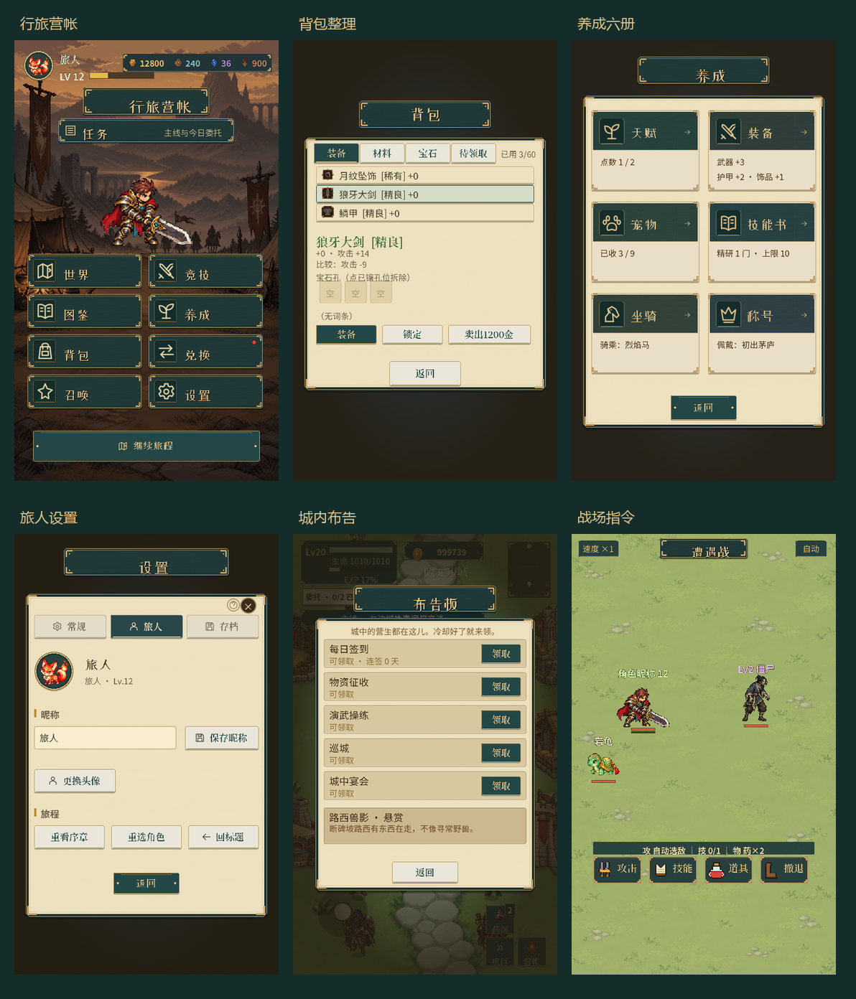

# 游戏内界面更新

延续已确认的行旅册风格：青铜页眉、暖纸、黄铜包角与三层字体。营帐、背包、设置、养成、城内交互、探索及战斗界面使用同一套细节。

同时修正了长屏遮罩、空背包说明换行、出征卡片文案裁切和底部按钮挤压。头像继续采用动物徽章。

35 种真实界面状态，480×800 和 480×1067 两种尺寸，共 70 张截图。全部成功输出，最终日志没有脚本错误或存档写入失败。

| 界面 | 普通屏 | 长屏 |
| --- | --- | --- |
| 营帐 | [查看](480x800/home.png) | [查看](480x1067/home.png) |
| 背包 | [查看](480x800/bag.png) | [查看](480x1067/bag.png) |
| 满页背包 | [查看](480x800/bag_full.png) | [查看](480x1067/bag_full.png) |
| 常规设置 | [查看](480x800/settings.png) | [查看](480x1067/settings.png) |
| 旅人设置 | [查看](480x800/settings_profile.png) | [查看](480x1067/settings_profile.png) |
| 存档设置 | [查看](480x800/settings2.png) | [查看](480x1067/settings2.png) |
| 访客簿 | [查看](480x800/city_guests.png) | [查看](480x1067/city_guests.png) |
| 布告板 | [查看](480x800/city_notice.png) | [查看](480x1067/city_notice.png) |
| 物资铺 | [查看](480x800/city_shop.png) | [查看](480x1067/city_shop.png) |
| 建筑修建 | [查看](480x800/city_build_panel.png) | [查看](480x1067/city_build_panel.png) |
| 城门 | [查看](480x800/gate.png) | [查看](480x1067/gate.png) |
| 图志阁 | [查看](480x800/archive.png) | [查看](480x1067/archive.png) |
| 探索界面 | [查看](480x800/main_world.png) | [查看](480x1067/main_world.png) |
| 历练战斗 | [查看](480x800/battle.png) | [查看](480x1067/battle.png) |
| 装备强化 | [查看](480x800/forge_enhance.png) | [查看](480x1067/forge_enhance.png) |
| 宝石镶嵌 | [查看](480x800/forge_gem.png) | [查看](480x1067/forge_gem.png) |
| 地区行路图 | [查看](480x800/worlds.png) | [查看](480x1067/worlds.png) |
| 演武场 | [查看](480x800/arena.png) | [查看](480x1067/arena.png) |
| 灵宠召唤 | [查看](480x800/gacha.png) | [查看](480x1067/gacha.png) |
| 登录 | [查看](480x800/login.png) | [查看](480x1067/login.png) |
| 头像选择 | [查看](480x800/avatar.png) | [查看](480x1067/avatar.png) |
| 任务 | [查看](480x800/quests.png) | [查看](480x1067/quests.png) |
| 装备 | [查看](480x800/equip.png) | [查看](480x1067/equip.png) |
| 技能书 | [查看](480x800/skillbook.png) | [查看](480x1067/skillbook.png) |
| 坐骑 | [查看](480x800/mount.png) | [查看](480x1067/mount.png) |
| 称号 | [查看](480x800/titles.png) | [查看](480x1067/titles.png) |
| 城内对话 | [查看](480x800/trade_warden_dialog.png) | [查看](480x1067/trade_warden_dialog.png) |
| 养成 | [查看](480x800/growth.png) | [查看](480x1067/growth.png) |
| 游戏标题 | [查看](480x800/title.png) | [查看](480x1067/title.png) |
| 战斗指令 | [查看](480x800/main_world_battle_commands.png) | [查看](480x1067/main_world_battle_commands.png) |
| 战斗技能 | [查看](480x800/main_world_battle_skills.png) | [查看](480x1067/main_world_battle_skills.png) |
| 宠物图鉴 | [查看](480x800/codex.png) | [查看](480x1067/codex.png) |
| 出征筹备 | [查看](480x800/deploy.png) | [查看](480x1067/deploy.png) |
| 创建角色 | [查看](480x800/createrole.png) | [查看](480x1067/createrole.png) |
| 灵宠养成 | [查看](480x800/pet_raise.png) | [查看](480x1067/pet_raise.png) |

功能和布局回归：11 组通过。涵盖返回、翻页、头像、装备、养成、城内操作、战斗，以及离树构建弹窗的长屏适配。

截图与测试均使用隔离的运行目录，不读取或改写正式玩家存档。日志中仍有本机证书存储和图形资源退出诊断；已单独检查，没有游戏脚本错误。
